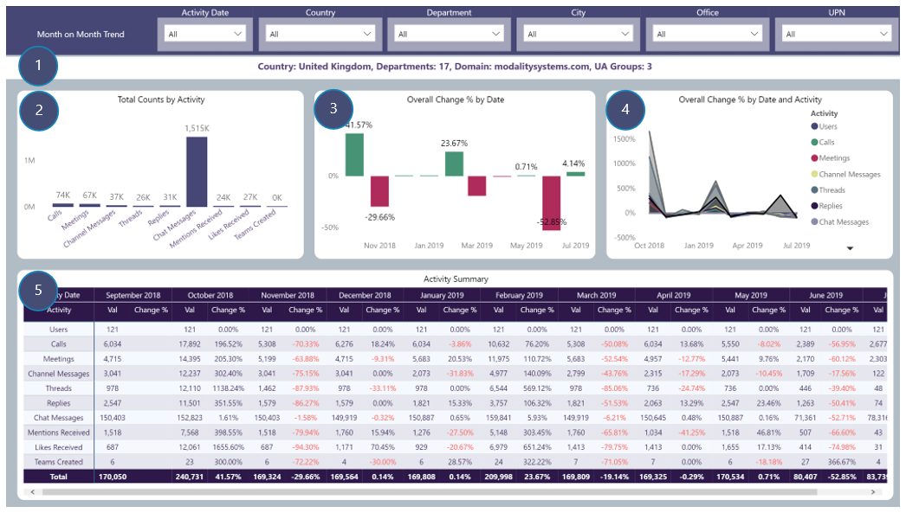

# Month on Month Trend
View Month on Month trend reporting by selected drill-through field focussing on activity counts and change percentages from one month to the next
### Drill-through available from table visuals displaying:
Country, City, Office, Department, Domain and UA Group name fields

## Page Visuals

### 1.	Drill-through Summary
Selected drill-through field and counts of other summary fields

### 2.	Total Counts by Activity
Counts of each Teams Activity by dill-through field

### 3.	Overall Change % by Date 
Month on Month change percentages by dill-through field to determine at a glance whether overall Teams activity is up or down between consecutive months

### 4.	Overall Change % by Date and Activity 
Month on Month change percentages by dill-through field to determine at a glance which type of Teams activity is up or down from one month to the next. Tooltip provides further insights

### 5.	Activity Summary 
Counts and Change Percentage by number of users, Team activity month on month and dill-through field
