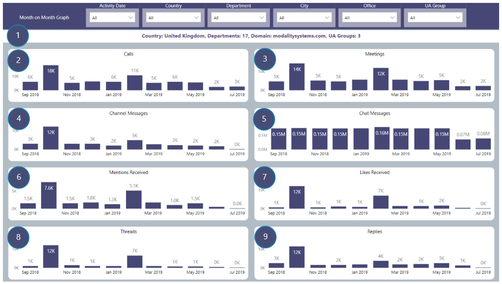

# Month on Month Graph
View of all Team activity on a monthly basis filtered by selected drill-through field
### Drill-through available from table visuals displaying:
Country, City, Office, Department, Domain and UA Group name fields

## Page Visuals

### 1.	Drill-through Summary
Selected drill-through field and counts of other summary fields

### 2.	Calls
Number of calls made on Teams by month and dill-through field

### 3.	Meetings
Number of Meetings made on Teams by month and dill-through field

### 4.	Channel Messages 
Number of Channel messages by month and drill-through field

### 5.	Chat messages
Number of Chat messages by month and drill-through field

### 6.	Mentions Received
Number of Mentions received for all users by month and drill-through field

### 7.	Likes Received
Number of Likes received for all users by month and drill-through field

### 8.	Threads
Number of Channel threads created by month and drill-through field

### 9.	Replies
Number of replies to Channel threads by month and drill-through field
