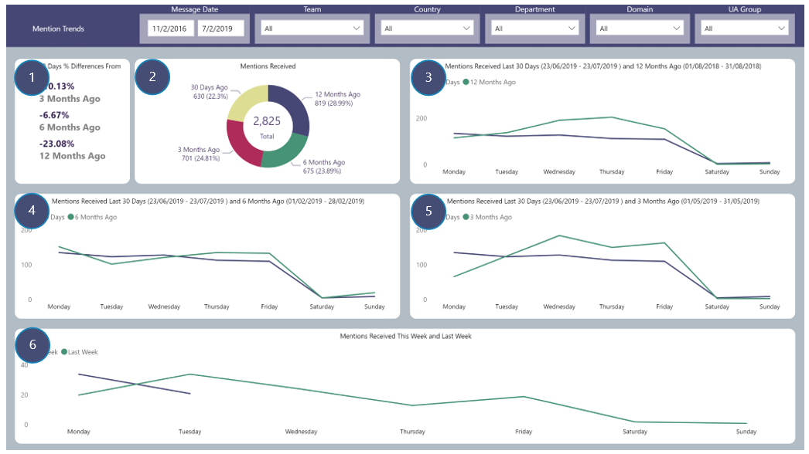

# Mention Trends
Reporting focusing on comparing the number of Mentions received by all Users in last 30 days versus 12, 6 and 3 months ago

## Page Visuals

### 1.	Last 30 Days % Differences From
Percentage change in Mentions received comparing last 30 days with 3, 6 and 12 months ago

### 2.	Mentions Received
Number of Mentions received for all Users for last 30 days and 3, 6 and 12 months ago

### 3.	Mentions Received Last 30 Days and 12 Months Ago
Comparing the number of Mentions received in last 30 days with the number of Mentions received 12 months ago over a 30 day period for each of the week

### 4.	Mentions Received Last 30 Days and 6 Months Ago
Same as 3 except for Mentions received over a 30 day period 6 months ago

### 5.	Mentions Received Last 30 Days and 3 Months Ago
Same as 3 except for Mentions received over a 30 day period 3 months ago

### 6.	Mentions Received This Week and Last Week
Number of Mentions received this week compared with the number of Mentions received last week for each day
