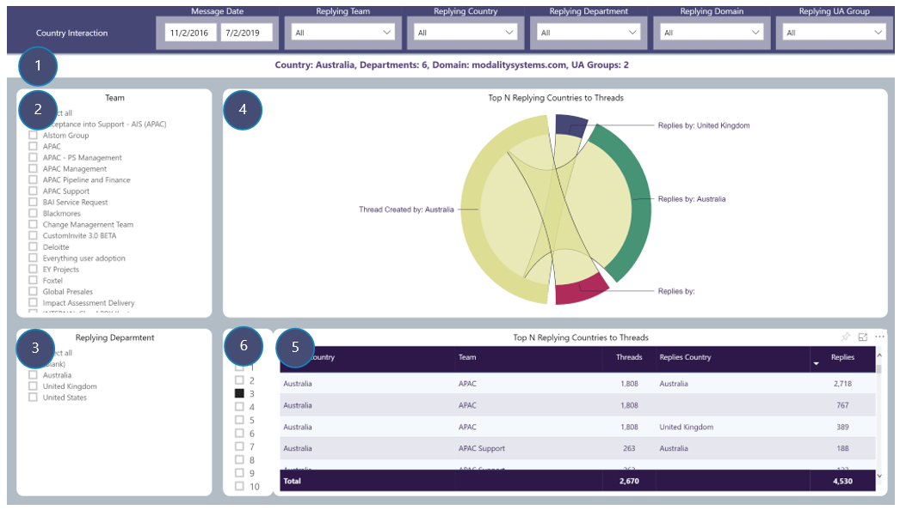

# Country Interaction
View number of Channel message threads by selected drill-through Country and number of replies by replying Countries to those threads

### Drill-through available from: 
Table visuals displaying Country

## Page Visuals

### 1.	Drill-through Summary
Country selected, Departments, Domains and UA Groups in selection

### 2.	Team
Filter report page by replying Team

### 3.	Replying Department
Filter report page by replying Departments

### 4.	Top N Replying Countries to Threads
Interaction between selected Country creating Channel message threads and Top N Countries replying to those threads

### 5.	Top N Replying Countries to Threads
Details of Country creating Channel message threads in each Team and replying Countries

### 6.	Top N Selector
Limit visuals in 5 and 6 to only displaying Top N replying Countries
