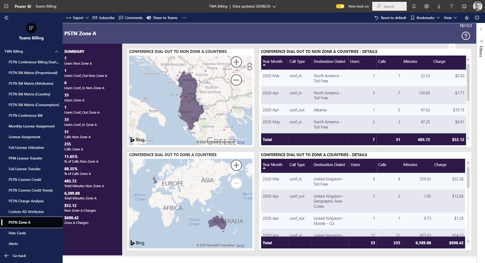

# PSTN Zone A

This page lists the conference calls dialled out to

- Non Zone A Countries - so will not be in any pool of included minutes for standard licence users
- Zone A countries - so will be included in any pool of minutes for standard licence users

This information can be filtered by (use Power BI page filters)

- Month
- Destination Dialled

For more details of Zone A countries see: 

https://docs.microsoft.com/en-us/microsoftteams/complimentary-dial-out-period

