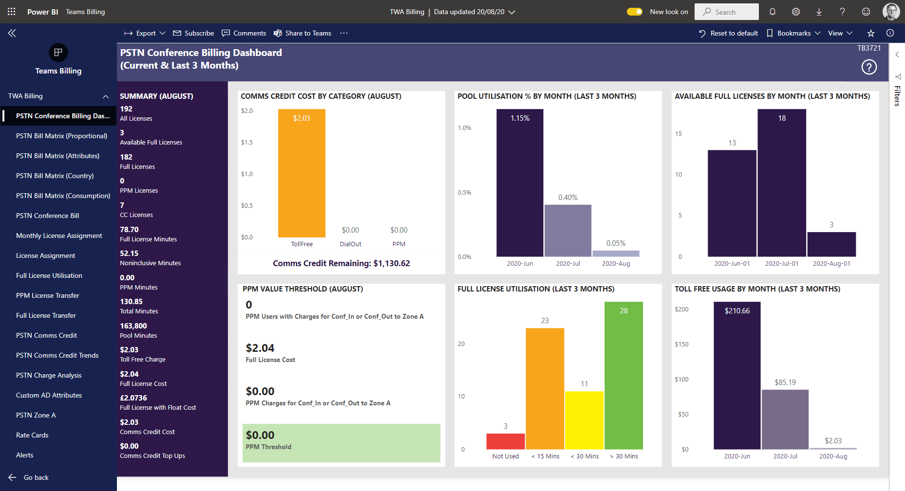

# PSTN Conference Billing Dashboard

## Current and Last 3 Months

This report is a dashboard overview of PSTN Conferencing usage. All reports are either the current month or last 3 months as labelled.

**Comms Credit Cost by Category** - breaks down all comms credit usage by type: TollFree, DialOut from a conference and Pay Per Minute Usage

**Pool Utilisation** - the percentage of usage of the pool of included minutes in standard licences

**PPM Value Threshold** - the threshold at which is makes sense commercially to move users between standard and PPM licences

**Full Licence Utilisation** - to what extent are full licences being used.

**Toll Free Usage by Month** - All toll free usage 

This information can be filtered by (use Power BI page filters)

- Month
