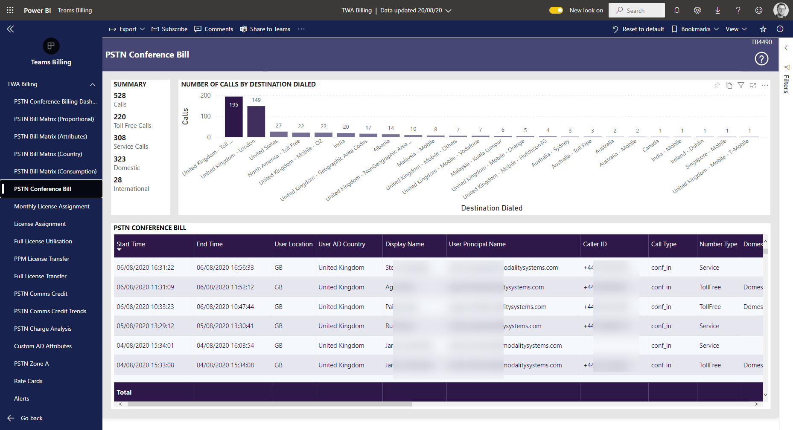

# PSTN Conference Bill

This page gives the full itemised PSTN Conference bill 

Number of called by destination dialed are number of outbound from the meeting by destination dailed.

This information can be filtered by (use Power BI page filters)

- Month
- Call Type (default is confin and confout)
- Date
- Start Time
- Active Directory User Principle Name of meeting owner
- AD Usage Location
- AD Country
- AD Department
- Number Type
- Capability
- Destination Number
