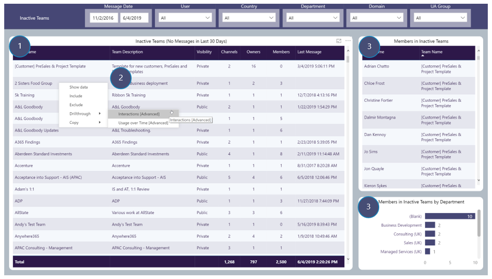

# Inactive Teams
Reporting on inactive Teams

## Page Visuals

### 1.	Inactive Teams (No Messages in Last 30 Days)
Details of Teams that have not had any Channel messages created in them in last 30 days

### 2.	Inactive Teams (No Messages in Last 30 Days): Drill-throughs
Standard Teams drill-throughs

### 3.	Members in Inactive Teams
Details of Users who are Members in inactive Teams

### 4.	Members in Inactive Teams by Department
Number of Members in inactive Teams by Department
 
