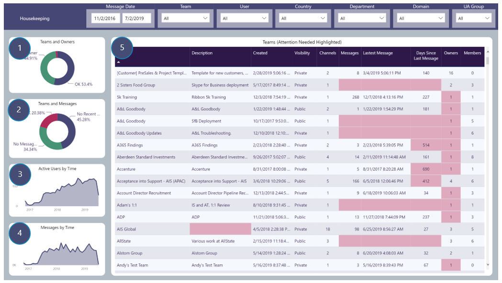

# House Keeping
Reporting on Team details and highlighting areas that may require attention by IT admins to ensure Teams Usage adheres to Company Policies

## Page Visuals

### 1.	Teams and Owners
Percentage of Teams that have more than one owner (OK), only one owner and no owners

### 2.	Teams and Messages
Percentage of Teams that have no recent messages (within last 30 days), no messages and messages created in last 30 days (OK) 

### 3.	Active Users by Time
Number of active users over time

### 4.	Messages by Time
Number of Channel messages being created over time

### 5.	Teams (Attention Needed Highlighted)
Team details with compliance issues highlighted, e.g. Teams without descriptions or with only one owner or with no message activity
