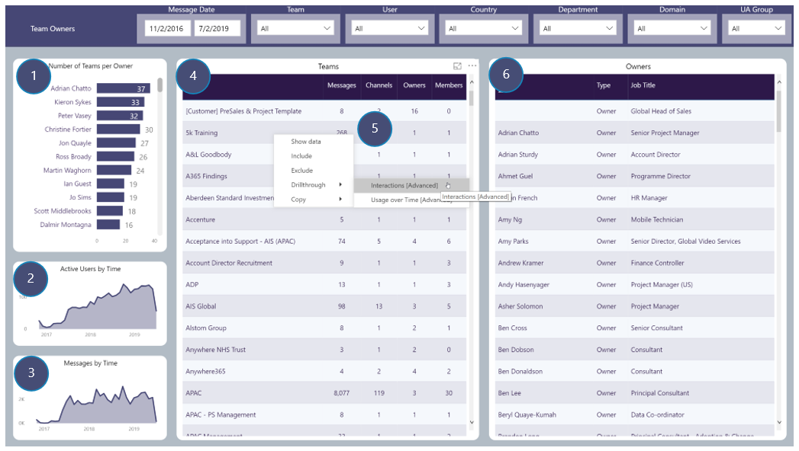

# Team Owners
Reporting on Teams and Owners 

## Page Visuals

### 1.	Number of Teams per Owner
Number of Teams each User is an Owner of

### 2.	Active Users by Time
Number of Users over time

### 3.	Messages by Time
Number of Channel messages being created over time

### 4.	Teams
Team details including number of Channels, messages, Owners and Members

### 5.	Teams: Drill-throughs
Standard Team drill-throughs included as visual includes Team name

### 6.	Owners
Team Owner details
