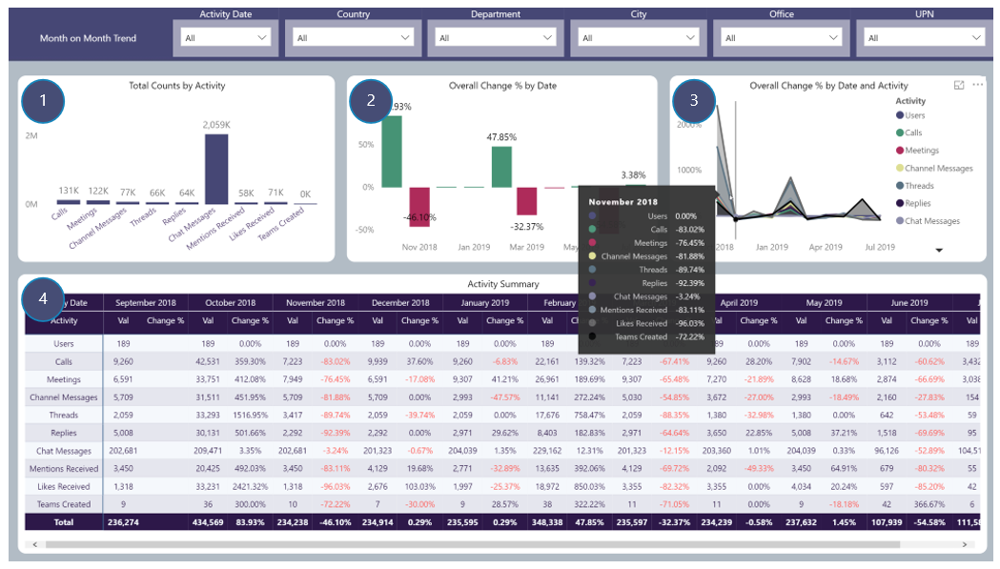

## Month on Month Trend
Month on Month Trend reporting focussing on activity counts and change percentages from one month to the next

## Page Visuals

### 1.	Total Counts by Activity
Counts of each Teams Activity

### 2.	Overall Change % by Date 
Month on Month change percentages to determine at a glance whether overall Teams activity is up or down between consecutive months

### 3.	Overall Change % by Date and Activity 
Month on Month change percentages to determine at a glance which type of Teams activity is up or down from one month to the next. Tooltip provides further insights

### 4.	Activity Summary 
Counts and Change Percentage by number of users and Team activity month on month 

