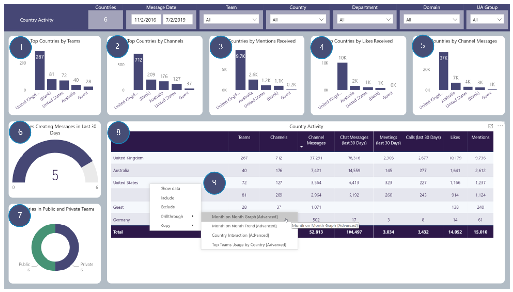

# Country Activity
Country Activity focusses on Top Countries by Teams Usage
Includes drill throughs

## Page Visuals

### 1.	Top Countries by Teams
Number of Teams per Country based on Message Activity 

### 2.	Top Countries by Channels
Number of Channels per Country based on Message Activity

### 3.	Top Countries by Mentions Received
Number of Mentions Received per Country

### 4.	Top Countries by Likes Received
Number of Likes Received per Country

### 5.	Top Countries by Channel Messages
Number of Channel Messages per Country

### 6.	Countries Creating Messages in Last 30 Days
How many Countries that Users are in that have created Channel Messages in the last 30 days

### 7.	Countries in Public and Private Teams
Number of Countries Users are in that have Message Activity in Public and Private Teams

### 2.	Top Countries by Channels
Number of Channels per Country based on Message Activity

### 3.	Top Countries by Mentions Received
Number of Mentions Received per Country

### 4.	Top Countries by Likes Received
Number of Likes Received per Country

### 5.	Top Countries by Channel Messages
Number of Channel Messages per Country

### 6.	Countries Creating Messages in Last 30 Days
How many Countries that Users are in that have created Channel Messages in the last 30 days

### 7.	Countries in Public and Private Teams
Number of Countries Users are in that have Message Activity in Public and Private Teams

### 8.	Country Activity
Number of Teams, Channels, Channel Messages etc per Country Users are in

### 9.	Country Activity: Drill-throughs  
More details for these, found in the Advanced Section  
Month on Month Graph  
Country Interaction  
Top Teams Usage by Country  
