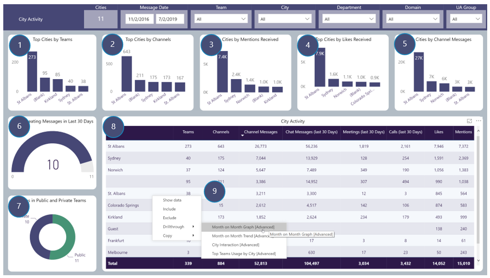

# City Activity
City Activity focusses on Top Cities by Teams Usage
Includes drill throughs

## Page Visuals

### 1.	Top Cities by Teams
Number of Teams per City based on Message Activity 
### 2.	Top Cities by Channels
Number of Channels per City based on Message Activity
### 3.	Top Cities by Mentions Received
Number of Mentions Received per City
### 4.	Top Cities by Likes Received
Number of Likes Received per City
### 5.	Top Cities by Channel Messages
Number of Channel Messages per City
### 6.	Cities Creating Messages in Last 30 Days
Number of Cities Users are in that have created Channel Messages in the last 30 days
### 7.	Cities in Public and Private Teams
Number of Cities Users are in that have Message Activity in Public and Private Teams
### 8.	City Activity
Number of Teams, Channels, Channel Messages etc per City Users are in
### 9.	City Activity: Drill-throughs
More details for these, found in the Advanced Section  
Month on Month Graph  
City Interaction  
Top Teams Usage by City
