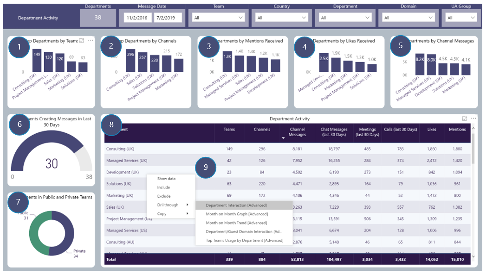

# Department Activity
Department Activity focusses on Users Team Activity by the Department they are in
Includes drill throughs

## Page Visuals

### 1.	Top Departments by Teams
Number of Teams per AD Department based on Message Activity 

### 2.	Top Departments by Channels
Number of Channels per Department based on Message Activity

### 3.	Top Departments by Mentions Received
Number of Mentions Received per Department

### 4.	Top Departments by Likes Received
Number of Likes Received per Department

### 5.	Top Departments by Channel Messages
Number of Channel Messages per Department

### 6.	Departments Creating Messages in Last 30 Days
Number of Department Users are in that have created Channel Messages in the last 30 days

### 7.	Departments in Public and Private Teams
Number of Departments Users are in that have Message Activity in Public and Private Teams

### 8.	Department Activity
Number of Teams, Channels, Channel Messages etc per Department Users are in

### 9.	Department Activity: Drill-throughs

More details for these, found in the Advanced Section  
Month on Month Graph  
Department Interaction  
Top Teams Usage by Department
