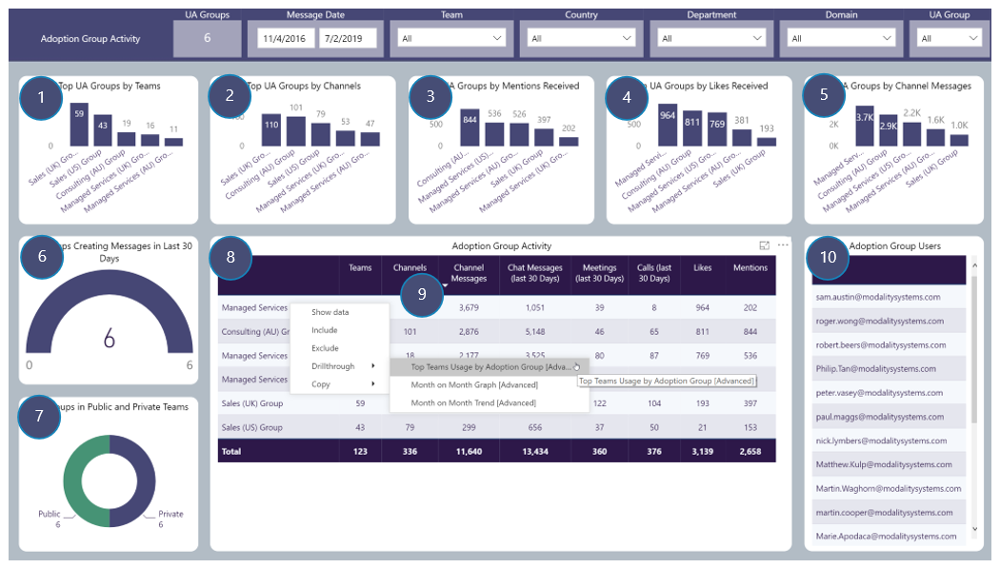

# Adoption Group Activity
Custom User Adoption Group (UA Group) activity focusses on UA Group Users Team activity by the UA Group they are in
Includes drill throughs

## Page Visuals

### 1.	Top UA Groups by Teams
Number of Teams per UA Group based on Message Activity 

### 2.	Top UA Groups by Channels
Number of Channels per UA Group based on Message Activity

### 3.	Top UA Groups by Mentions Received
Number of Mentions Received per UA Group

### 4.	Top UA Groups by Likes Received
Number of Likes Received per UA Group

### 5.	Top UA Groups by Channel Messages
Number of Channel Messages per UA Group

### 6.	UA Groups Creating Messages in Last 30 Days
Number of UA Group Users are in that have created Channel Messages in the last 30 days

### 7.	UA Groups in Public and Private Teams
Number of UA Group Users are in that have Message Activity in Public and Private Teams

### 8.	Adoption Group Activity
Number of Teams, Channels, Channel Messages etc per UA Group Users are in

### 9.	Adoption Group Activity: Drill-throughs
More details for these, found in the Advanced Section  
Month on Month Graph  
Month on Month Trend  
Top Teams Usage by Adoption Group

### 10.	Adoption Group Users
All Users in all UA Groups
