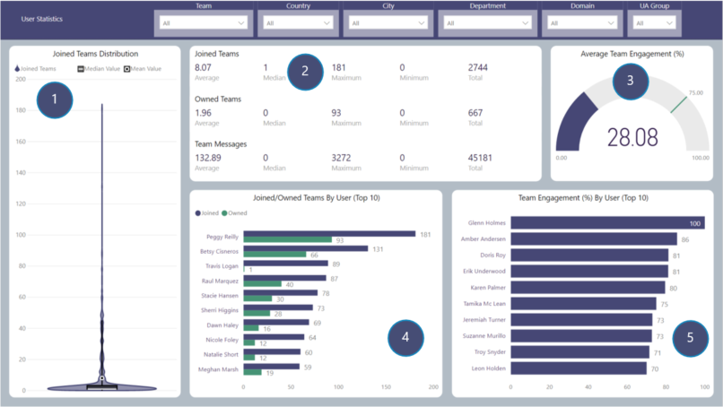

# User Statistics
Breakdown of statistics for Users

## Page Visuals

### 1.	Joined Teams Distribution
Number of Teams joined by individual users including median and mean values

### 2.	Joined Teams, Owned Teams & Team Messages
Average, Median, Maximum, Minimum and Total for each value

### 3.	Average Team Engagement
Average team engagement by percentage

### 4.	Joined/Owned Teams by User (Top 10)
Top 10 Users listed by Team membership count

### 5.	Team Engagement By User (Top 10)
Top 10 users by team engagement

