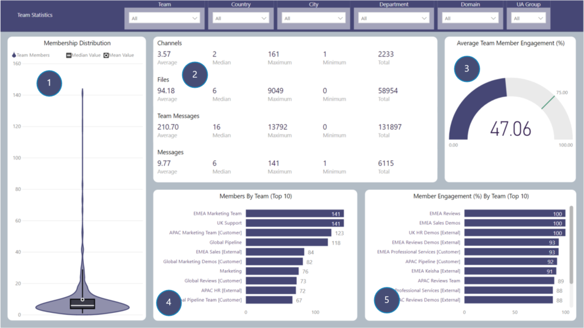

# Team Statistics
Breakdown of statistics for Teams

## Page Visuals

### 1.	Membership Distribution
Member count per team including median and mean values

### 2.	Channels, Files, Team Messages & Messages
Average, Median, Maximum, Minimum and Total for each value

### 3.	Average Team Member Engagement
Average team member engagement by percentage

### 4.	Members by Team (Top 10)
Top 10 Teams listed by member count

### 5.	Member Engagement By Team (Top 10)
Top 10 Teams by member engagement