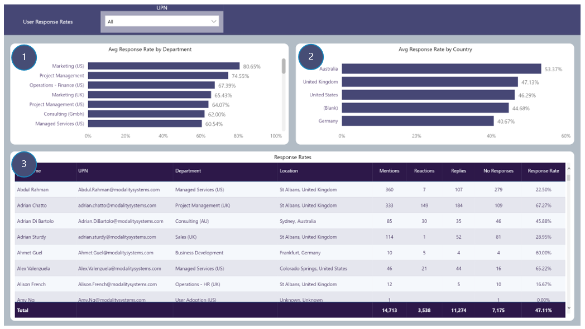

# User Response Rates
Reporting focussing on Response Rates by Department, Country and User. Response Rates are the number of User reactions or replies to Channel messages they have been mentioned in  

## Page Visuals

### 4.	Avg Response Rate by Department
Visual showing average Response Rate for all Users in each Department

### 5.	Avg Response Rate by Country
Average Response Rate for all Users in each Country location

### 6.	Response Rates
Average Response Rate per User (see Response Rate Calculation below)
 
## Response Rate Calculation
 

