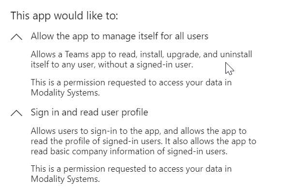

# Authorisation for Teamwork Analytics SaaS

The following steps must be completed with an account with **Azure Active Directory Global Administrator** rights.

## Reporting permissions

On following the [Reporting authorisation link](https://mod.qa/ReportConsent), you will be prompted to sign in to Office 365 with your admin account.

Once authenticated, a summary of the app and permissions requested is shown.

The arrows can be expanded to review further detail for each section.

Clicking **Accept** will complete the process and show a final page.

## Teamwork Automation permissions (Required for Notification Service)

On following the [Automation authorisation link](https://mod.qa/AutomationConsent), you will be prompted to sign in to Office 365 with your admin account.

Once authenticated, a summary of the app and permissions requested is shown.

The arrows can be expanded to review further detail for each section.

Clicking **Accept** will complete the process and show a final page.

## Rolling back / revoking application permissions

Need to remove the permissions that were granted with the authorisation links?

Open the [Azure Portal](https://portal.azure.com) and sign in with your admin accounts.

Navigate to **Azure Active Directory** and click **Enterprise applications**.

Click **Teamwork Analytics Automation** and manage **Properties**. Click on the **Delete** button.

Click **Teamwork Analytics** and manage **Properties**. Click on the **Delete** button.

