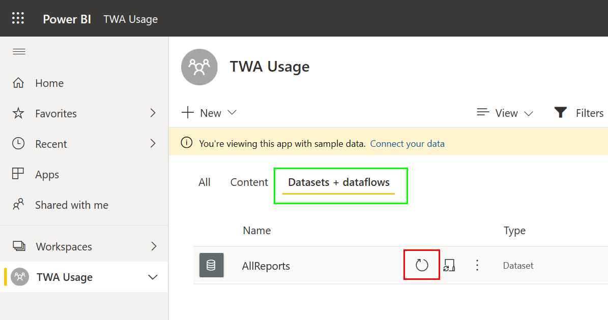
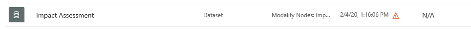
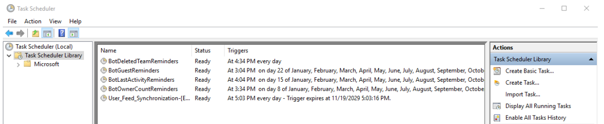

# How to raise a support ticket *

### Please review the following sections before raising a support request

Below are a number of basic actions that could resolve a number of issues faced.

## 1) TWA Data out of date? - PowerBI Refresh

Teamwork Analytics (TWA) presents it's data within PowerBI Apps. These are hosted within PowerBI.com and the data is refreshed regularly from your backend SQL database. It's possible for the refresh to fail and hence, the data appear out of date due to a number of transient issues. These are normally resolved during the next scheduled refresh, but you have the ability to manually refresh the data and observe any errors.

Navigate to the PowerBI workspace where your App is deployed as shown below. Navigate to the 'Datasets + dataflows' tab (green box) and after hovering over the relevant dataset, you will have the option to manually refresh your data (red box). Once refreshed, please review your data to confirm it is up to date

If there is an error with the refresh, a clear warning will be shown.

Clicking on the warning triangle will give you the option to show the technical details of the error. If your refresh fails 3 times, please capture these technical details and raise a support ticket with our support team.

## 2) Teamwork Analytics Service

The Teamwork Analytics Service should be running at all times. This service controls the process which is collecting the required data from your tenant. If the service isn't running, no data collection will be possible. 

To check the status of this service, you will need to log onto the TWA VM created during the deployment with the server credentials you created. If the service is stopped, please start the service. If the service is running but you have concerns due to other actions undertaken on the server i.e. Updates, you are able to safely restart the service without impacting the process. 

## 3) PowerBI reports show empty tables/reports - are you running the latest version?

After checking the previous points, PowerBi refresh and TWA Service, please review the 'About' Report which can be found under the 'Advanced' section of both the TWA Usage and TWA Governance & Security Reports. In this section you can see the versions you currently have deployed for both the TWA backend and PowerBI App.

It's possible we have released new versions due to Microsoft API changes and/or bug fixes.

The current latest versions are:
Name | Version
--- | ---
TWA Data Warehouse | **2020.5.21.2**
PowerBI App | **2020.03.17**

If you aren't running the latest release, we recommend updating to the latest available version before continuing to review. Details on how to upgrade can be found [here](UpgradingTeamworkAnalytics.md).

## 4) My users aren't receiving Bot notifications as planned

Bot notifications are generated by the individual scenarios and corresponding triggers. However, the enablement and frequency of the prices is controlled by individual tasks within Task Scheduler. We recommend you review these tasks in the first instance. Are they enabled? Is the frequency as expected?

Guidance on how the frequency can be enabled can be found [here](NotificationTaskScheduling.md)

## My issue hasn't been resolved and I need to raise a support ticket

Should you want support on any element of Teamwork Analytics, please email software.support@modalitysystems.com

If you believe you have an issue with the product, it may help us to have the following

- Screenshot of the Advanced / About page in PowerBI. This gives us all your product version numbers and data refresh history
- Logs from the Data Collector, these are available at C:\Program Files\Modality\GraphETL\Logs on the virtual machine. Please ZIP the whole folder
