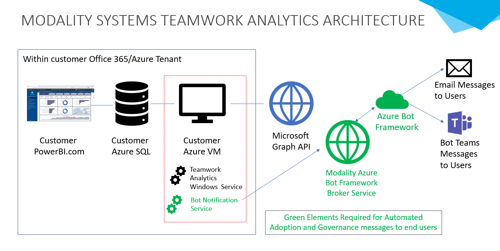

## Teamwork Analytic Architecture Overview

This page gives an overview of the complete Teamwork Analytics Architecture.

It is a relatively simple architecture comprising of:

- PowerBI.com Apps on customer tenant
- Azure Windows virtual machine and Azure SQL on customer tenant
- Azure Bot Service

### PowerBI.com Apps

Starting from customer end user looking at reporting. Reporting is broken down into a number of distinct PowerBI.com apps. These are downloaded by the customer from Microsoft Appsource into the customers PowerBI.com tenant. It is recommended a single administrator downloads the PowerBI.com Apps, configures them to connect to SQL (see below) and then distributes them to other users.

These PowerBI apps are available from [Microsoft AppSource](https://modalitysoftware.com/twa)

PowerBI Apps Installation and Upgrade guide: [Teamwork Analytics Power BI Apps installation guide](/PowerBIAppsAdminInstallGuide.md)

#### Azure SQL

Customer data is stored in SQL Azure in the customers tenant. PowerBI.com Apps connect to this SQL to report on data. The connection is directly from the customers PowerBI.com to the customers Azure. No data is held or stored by Modality Systems.

The ARM template deploys this Azure SQL for the customer

#### Azure windows Virtual Machine

The ARM template deployed an Azure Windows Virtual Machine in the customers tenant. It installs either just Teamwork Analytic Graph Data Collector or Teamwork Analytic Graph Data Collector and Bot Notification Service

#### Teamwork Analytic Graph Data Collector Windows Service

This windows service uses read only permissions granted by an [Azure AppID](/twa/registerapplication.md) creatred by the customers Office 365 administrator. It reads relevant data from graph, collects metadata and writes it to the customers Azure SQL

#### Bot Notificaiton Service

If the customer selects this option in the ARM template deployment. This windows service performs specific queries on the Azure SQL to create triggers for automated emails or Bot messages to end users. Customers can control which triggers run and which times through Windows Task Scheduler events. Modality Systems can assist in configuring this for customers.

The Notificaiton Service notifies the Azure Bot Framework via the Modality Systems Azure Bot Service.

#### Azure Bot Service

Azure Bot Service is a shared Azure Service that securely allows the sending of emails and Bot messages direct to Microsoft Teams end users. Te Bot Notification Windows Service send a trigger message on 443/TLS to the Modality Systems Azure Bot Service Broker which leverages the Azure Bot Service.
