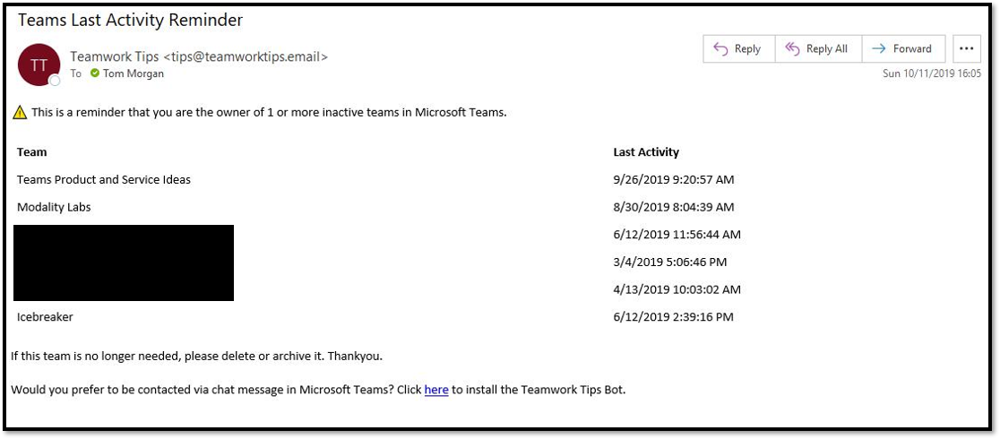

# Teamwork Analytics Automation Scenarios aka "Bots"

There are 4 "bot" / automation scenarios

1. Team Ownership – Confirm there are X owners per team
2. Guest Report – remind owners they have guests in X teams and are responsible for the information they have access to
3. Inactive Team – If a Team hasn’t been used in X time notify owners to achieve or delete it    
    * This scenario supports a second argument representing a report window. The value must be a positive value above 0 and represents the amount of days used to determine if the team is inactive. For example, if 5 is entered then the scenario will trigger based on the team being inactive for 5 days.
4. Deleted Team – Notify all owners and/or all members if a team is deleted

> Scenarios 1,2 and 3 return a max of 100 teams, per user. This is due to restrictions of bot framework message sizes.

Automation alerts will always default to emailing the target person first. Currently Microsoft's Bot famework does not allow directly private messaging a Teams user via "bot" without that user first clicking to agree to recieve messages from the bot.

In the email, if the user clicks the link on the email to “use the bot” they get private bot messages

Example Email:

Example Private Chat Message from the Bot in Teams:

