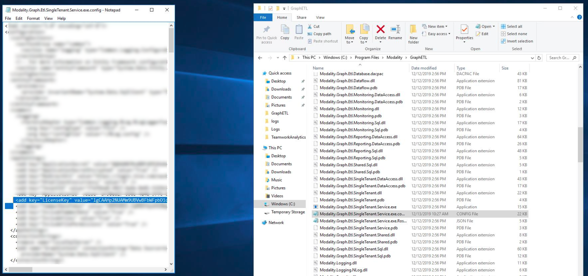

## How does Teamwork Analytics deal with Microsoft Graph Throttling?

Teamwork Analytics pulls data from Microsoft Graph via HTTPS. The Teamwork Analytics windows service has 4 concurrent https clients that can run with request up twice per second. However, Microsoft Graph throttles requests to an appropriate speed for Microsoft which means Teamwork Analytics does not always reach its theoretical maximum speed of data collection.

We follow Microsoft guidance which states "When throttling occurs, Microsoft Graph returns HTTP status code 429 (Too many requests), and the requests fail. A suggested wait time is returned in the response header of the failed request.". We respect this suggested wait time in line with best practice.

Microsoft do not publish what their limits are for Graph for Microsoft Teams. Here is their documentation: https://docs.microsoft.com/en-us/graph/throttling

Customers cannot control this behaviour, it is automatically handled in the Teamwork Analytics application.

## How does Modality Systems Teamwork Analytics define an Active user?

Both Microsoft and Modality Systems use the term 'Active Users' in reporting. The Modality Systems definition of an active user is one that has **sent a message** to a channel (e.g. in a Team) in the **last 30 days**. It was a deliberate decision to focus on "active" for collaboration, however we have been asked to also consider Private Chat, Meetings and Calling activity.

In a future update TWA will also consider private chat, meeting and calling usage to flag a user as active. This is commited on the roadmap for 2020 Q1. It will offer Monthly Active Usage and Weekly Active Usage reports of each Modality/functionality.

The Microsoft definition of Active User changes depending on the report being viewed. For more information, see [Microsoft Teams analytics and reporting](https://docs.microsoft.com/en-us/microsoftteams/teams-analytics-and-reports/teams-reporting-reference).

## How do Modality Systems Teamwork Analytics Licence Keys work?

For Teamwork Analytics backend to run you will need an active and current licence key from Modality Systems. To get a key for a trial please contact trial.support@modalitysystems.com. Paid customers will get their key issued at time of purchase.

The key is unique to each customer and defines which Teamwork Analytics modules are enabled. It is time-bound to the agreed licence term. There is no licence key on the PowerBI Apps. If a key expires, data will stop being collected, but existing data will not be deleted. PowerBI Apps will continue to work on the existing data. For up to 28 days, If a valid licence is added, the data missed during the period of no licence will be collected and added as part of the collection process. 28 days is the limit Microsoft give for pulling some of the daily statistics we use, after 28 days we will still collect most data, but some statistics on usage may have gaps.

The key is input at the time of deploying the ARM Template or the manual Powershell install.

If you need to update or input a new key, you can re-run the ARM Template or PowerShell installer, or edit the field manually in the configuration file: C:\Program Files\Modality\GraphETL\Modality.Graph.Etl.SingleTenant.Service.exe.config

## Can you report on usage of apps pinned in Teams, like OneNote or Planner?

Teamwork Analytics can report on which apps have been added as a tab in teams/channels, but not their actual amount of usage, either usage from with teams (e.g. how often a tab is used) or usage of the app regardless of use being inside or outside of Teams, .e.g. how often a OneNote is used.

If customers have the requirement, we can investigate what usage reporting Office 365 or third party apps have available via API and if we could make PowerBI usage reports for them. Please contact us to discuss this requirement.
