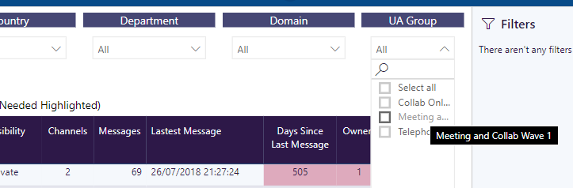

# User Adoption Groups

Teamwork Analytics allows you to create custom groups of users for reporting. This can be useful if you want to analyse Teams usage across a group of users who might not be in a related by an attribute in the Teamwork Analytics Database. The groups are called adoption groups, as they have typically been used to manage the effectiveness of user adoption programmes across groups of users.

The adoption groups can be configured by importing data into the "reporting.CustomUserGroups" table. This table contains the following columns;

- **Id** - Auto populated, does not need to be imported.
- **GroupName** - The name of your custom adoption group.
- **Upn** - The User Principal Name of the user you wish to add to this group (this must match the name in Azure AD)
- **Department** - Reserved for future use - please leave blank.

An example of this data could be as follows;

| Id | GroupName | Upn | Department |
| ------------- | ------------- | ------------- | ------------- |
| 1  | Meeting Adoption Wave 1  | user1@domain.com  | *null* |
| 2  | Meeting Adoption Wave 1  | user2@domain.com  | *null* |
| 3  | Meeting Adoption Wave 2  | user3@domain.com  | *null* |
| 4  | Meeting Adoption Wave 2  | user4@domain.com  | *null* |

The adoption groups will become visible in the UA Group filters in Teamwork Analytics Power BI reports similar to the screen shot below;

To import the data, you can use your favourite tool for importing to a SQL Server database (be sure not to change any other tables), or contact Modality and our consulting team can help you.
