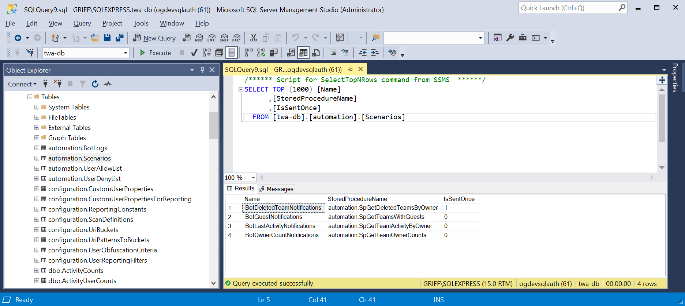
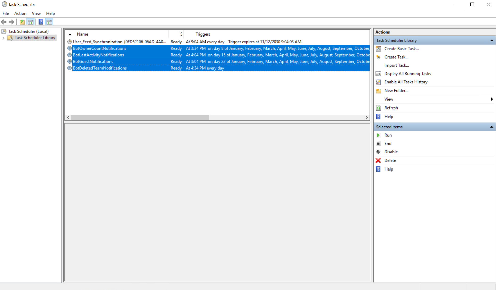

# Teamwork Analytics Automation - Configuring Scenarios

## Overview
Teamwork Analytics Automation (TWA Automation) has access to all of the data stored by TWA, meaning it is possible to use this data to create any number of configure scenarios. If the criteria is met in the scenario and returns data, then this will enable automated messages to be sent direct to users via email or Microsoft Teams. Configuration of new or existing scenarios is a multi-step process and is described in this document.

### What can I trigger an Automation scenario from?

It is important to understand that the Teamwork Analytics database contains the "current state" of the teams enviromnet, but generally does not track/log "change". So it can tell you, at the current time, which teams are public and which are private, but not, when a particular team "changed" from private to public.

#### Repeating Scheduled Scenararios - messages repeat each X period if the state doesn't change

Most automations work on schedules, we call these scheduled scenarios:
 - Every 3 months remind users about guests
 - Ever month remind owners about inactive teams
 - Every week remind users about teams that only have 1 owner

You can also use multiple scenarios to "escelate" messaging
- This team has been inactive for 30 days
- This team has been inactive for 45 days
- This team has been inactive for 90 days or more

In these cases, the triggers are non-overlapping. e.g. find teams inactive for more than 30 days but less than 44 days, so teams will only appear in one scenario.

#### Send Once Scenarios - the message is sent once and future messages for the same senario are supressed

We can also trigger automations to only send the message once. This is based on the exact text of the message. These are **"send once scenarios"**

In these scenarios the specific notificaiton for the specific user(s) will only send once 

e.g. the trigger will scan for all deleted teams in a time window, e.g last 7 days, but then the automation checks if the exact message has been sent before. f it has, it will not be sent, if it hasn't it will be sent. - the scenario runs daily, but only sends new messages. This means we can alert daily on "newly deleted teams".

These work well when a query can be time bound, for example we have team creation date and team deletion date

- This is a recently created team, for which you are the owner, here are our policies, here are some tips
- This is a recently created public team, we prefer teams to be private
- This is a recently deleted team, are you sure you want it to be deleted?


### Create or Edit a Scenario
Everything related to TWA Automation is located within the TWA database which will be located within the "automation" schema, for example a table would be labelled as "automation.tablename". Unless specifically instructed here do not change the database schema or data content of this database. Only the areas specified in these docs should be configured as documented.

Creating a new scenario involves:

1. Creating a new stored procedure to retrieve the list of users which match the scenario, and any associated data
2. Adding the scenario to the list of scenarios in configuration
3. Defining a new template for the messages sent to users (either via Microsoft Teams message or email)
4. Defining a schedule for the new scenario to operate on

Existing scenarios can be modified in any of the 4 ways described.

#### 1. Create a Stored Procedure

1. Connect to the TWA Database
2. Create a stored procedure, ensure that it has a schema (prefix) of **"automation"**, for example **"automation.spNewScenario"**
3. It is important to the whole process, that the stored procedure **has to return** the following columns*
   1. UserId
   2. UserMailAddress
4. Any additional columns which are returned will be supported, but are not a requirement in order to function
5. Parameters are **not** supported, so do not add these e.g. automation.spNewScenario @Name nvarchar(30)
6. Run the SQL inside of the procedure and test that the data you expect is returned and that no errors occur
7. Use the code below (BotGuestNotifications Scenario) as a guide to writing your own custom scenario:

```sql
CREATE PROCEDURE [automation].[SpGetTeamsWithGuests]
AS
BEGIN
	SELECT 
		teams.[TeamID]
		,teams.[DisplayName] AS TeamDisplayName
		,teams.[LastActivity]
		,towners.[UserID] AS UserID
		,towners.[UserName] AS OwnerDisplayName
		,towners.[Mail] AS UserMailAddress
		,towners.[External] AS OwnerIsExternal
		,COUNT(tguests.[UserID]) AS GuestCount 
	FROM automation.Teams teams 
		JOIN automation.TeamUsers towners ON towners.[TeamID] = teams.[TeamID]
		JOIN automation.TeamUsers tguests ON tguests.[TeamID] = teams.[TeamID]
	WHERE 
		teams.IsArchived=0 
		AND towners.[External] = 0
		AND towners.[UserType] = 'Owner' 
		AND tguests.[DataType] = 'Guest'
		AND towners.[Anonymised] = 0
	GROUP BY
		teams.[TeamID]
		,teams.[DisplayName]
		,teams.[LastActivity]
		,towners.[UserID]
		,towners.[UserName]
		,towners.[Mail]
		,towners.[External]
END
GO
```

> \*These columns **must** must return values and are case sensitive. If there are any rows that do not have a value for one of these properties, that row will be ignored and logged. Only valid rows will be sent to the cloud solution. Any additional columns that are returned will be processed.

#### 2. Add the scenario to the list of scenarios in configuration

Edit the table **"automation.Scenarios"**, adding a new row to define the new scenario.

This table contains the following columns:

- Name - This should match the parameter passed in by the notification service.
- StoredProcedureName - The name of the stored procedure which shall be searched for when the notification service runs.
- IsSentOnce
  - If set to _1_ (true), a message (email/im) with specific content will only be sent to a user once, if the scenario is run again the message will not be resent. If set to _0_ (false), a message will be sent every time the notification service is run regardless of if it's been sent before.
  - Additionally when _true_, each message will contain data from a single row returned by the stored procedure ,meaning a single user can receive many messages. Whereas when turned off, rows are grouped by the user they are being sent to, meaning a single user will only receive one message detailing all returned rows per scenario.

By default, the following values should be populated in the table:


### 3. Defining a new template for the messages sent to users (either via Microsoft Teams message or email)

Template definition is defined in the Azure Table Storage store, in the **"ScenarioTemplates"** table. This table has the following columns:

* PartitionKey - represents the tenant id
* RowKey - must match name of the scenario
* EmailSubject - the email subject which will display when the scenario sends an email
* EmailTemplate - the content which will display when the scenario sends an email
* TeamsCardTemplate - the content which will display when the scenario sends a Teams IM

>If this table does not exist or is completely empty the four default scenarios which mentioned above will still work using hardcoded values.

>Templates for existing scenarios can be changed by editing this table, and will take effect the next time the scenario is scheduled.

Email and card templates have two different specific formats they must be written in, here is an example of both for the BotGuestNotifications Scenario:

**Email Template:**
```html
<!DOCTYPE html>
<html lang="en">
<head>
    <style>
        th {
            text-align: left;
        }

        th, td {
            padding: 5px;
        }
    </style>
</head>
<body>
    <p>⚠ This is a notification that you are the owner of 1 or more teams in Microsoft Teams that have external users (guests). As an owner, please ensure that access is appropriate for the content being shared in that team.</p>
    <table style="width:100%">
        <tr>
            <th>Team</th>
            <th>Guests</th>
            <th>Last Activity</th>
        </tr>
        @foreach (var item in @Model.Notification.RowsWithAdditionalProperties)
        {
            <tr>
                @if (@item.Value.ContainsKey("TeamDisplayName"))
                {
                    <td>@item.Value["TeamDisplayName"]</td>
                }
                @if (@item.Value.ContainsKey("GuestCount"))
                {
                    <td>@item.Value["GuestCount"]</td>
                }
                @if (@item.Value.ContainsKey("LastActivity"))
                {
                    <td>@item.Value["LastActivity"]</td>
                }
            </tr>
        }
    </table>
    @if (@Model.BotInstallationLink != null)
    {
        <p>Would you prefer to be contacted via chat message in Microsoft Teams? Click <a href="@Model.BotInstallationLink">here</a> to install the Teamwork Tips Bot.</p>
    }
</body>
</html>
```

**Card Template:**

```json
{
  "$schema": "http://adaptivecards.io/schemas/adaptive-card.json",
  "type": "AdaptiveCard",
  "version": "1.0",
  "body": 
  [
    {
      "type": "TextBlock",
      "size": "default",
      "text": "Teams with Guests",
	  "weight": "Bolder",
      "wrap": true
    },
    {
      "type": "TextBlock",
      "size": "default",
      "text": "⚠ This is a notification that you are the owner of 1 or more teams in Microsoft Teams that have external users (guests). As an owner, please ensure that access is appropriate for the content being shared in that team.",
      "wrap": true
    },
    {
      "type": "Container",
      "style": "emphasis",
      "items": 
      [
        {
          "type": "ColumnSet",
          "columns": 
          [
            {
              "type": "Column",
              "width": 55,
              "items": 
              [
                {
                  "type": "TextBlock",
                  "text": "Team",
                  "weight": "Bolder"
                },
                                    @{
                                    int i = 0;
                                    foreach(var item in @Model.Notification.RowsWithAdditionalProperties) {
                                        if (++i > 1) {
                                            @:,
										}
										if (@item.Value.ContainsKey("TeamDisplayName"))
										{
										<text>
										{
										  "type": "TextBlock",
										  "text": "@item.Value["TeamDisplayName"]"
										}
										</text>
										}
									}
								}
							]
						},
						{
							"type": "Column",
							"width": 15,
							"items": 
							[
								{
									"type": "TextBlock",
									"text": "Guests",
									"weight": "Bolder"
								},
								@{
									int j = 0;
									foreach(var item in @Model.Notification.RowsWithAdditionalProperties) {
										if (++j > 1) {
											@:,
										}
										if (@item.Value.ContainsKey("GuestCount"))
										{
										<text>
										{
										  "type": "TextBlock",
										  "text": "@item.Value["GuestCount"]"
										}
										</text>
										}
									}
								}
							]
						},
						{
							"type": "Column",
							"width": 30,
							"items": 
							[
								{
									"type": "TextBlock",
									"text": "Last Activity",
									"weight": "Bolder"
								},
								@{
									int k = 0;
									foreach(var item in @Model.Notification.RowsWithAdditionalProperties) {
										if (++k > 1) {
											@:,
										}
										if (@item.Value.ContainsKey("LastActivity"))
										{
										<text>
										{
										  "type": "TextBlock",
										  "text": "@item.Value["LastActivity"]"
										}
										</text>
										}
									}
								}
							] 
						} 
					] 
				}
			]
		},
		{
			"type": "TextBlock",
			"size": "default",
			"text": "Thank you for your help.",
			"wrap": true
		}
	]
}
```

### 4. Defining a schedule for the new scenario to operate on

Each scenario requires its own scheduled task on the machine where the bot notification service is located.

The bot notification service, only processes 1 scenario, which is detected by a parameter passed into the service. This is why, once the ARM template has been deployed to a machine, there will be 4 scheduled tasks, all configured and set up to point to the scenarios configured in SQL. As seen below:


Create a new scheduled task, copying the executable path from the other scheduled tasks. The only difference is that you will need to enter in the scenario name value that you gave within the SQL DB. To do this, follow these steps:

1. Set up a new scheduled task/or re-use existing task by:
   1. Export existing task
   2. Import the exported task with the name of the your new scenario
2. Open your new task
   1. Click "Actions"
   2. Highlight the "Start a program" action
   3. Click "Edit"
   4. Update "Add Arguments (Optional)" parameter to be the same as the scenario name you entered in SQL.

> Make sure the task has "run when there is no one logged in" set.

> Ensure that the name matches exactly the same as the "name" column that you added into the Scenarios SQL table.

>Pay close attention to the scheduled times which you set-up for your task, take into account what your custom stored procedure is doing (for example, is the data over a specified amount of time) and set a reasonable time to run, also consider the remaining tasks scheduled times.

## Running Configured Scenario

Follow all the steps above should now mean that any user that meets the criteria for your scenario will receive a Teams IM or email when ran at the configured time.

If you wish to test your scenario immediately, simple connect to the machine where the scheduled tasks are configured and run the task. However, bear in mind that if all configured correctly - the users will receive a Teams IM or email.

> There is a cap in the notification service that only returns a max of 100 teams, per user. This is due to restrictions of Bot Framework message sizes.
