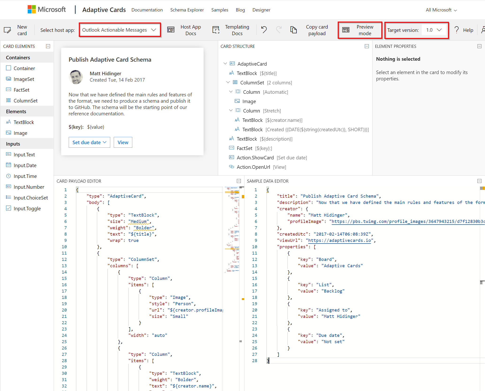

# Create an Adaptive Card Template

This page describes how to create a custom Adaptive Card Template for your _TWA Automation_ custom scenario. Once configured in Azure Storage, _TWA Automation_ will use the template to create an Adaptive Card which can be sent to either Outlook or a Teams chat depending on your set up.

This guide will briefly explain what an Adaptive Card Template is and how to create one. In order to make the process creating a template easier We have made a [example template](#example-template) which contains multiple example _components_, which you can copy in to your template.

## What is an Adaptive Card?

An Adaptive Card is way of displaying and formatting custom content inside of larger client, such as Teams, Outlook, Skype, Cortana and Web Chat. What makes Adaptive Cards different to most markup languages is how the data is styled so it looks and feels like the host client. This means that an Adaptive Card displayed in Teams will look and feel like native Teams content, when the same card is displayed in Skype, it will look like native Skype content.

For a more in depth explanation af Adaptive Cards you can visit the [Microsoft's Adaptive Card Documentation](https://docs.microsoft.com/en-us/adaptive-cards/).

## What is an Adaptive Card Template?

The Adaptive Card JSON payload that gets sent to a client contains the data to be displayed, and information about how to format, style and display that content. Adaptive Card Templates enables the separation of the data from from the layout. The means that we can create a template, that will define what information should be displayed and how it will arranged. The _TWA Automation Bot_ will then populate the template with dynamic content, before it gets sent to Teams or by email.

Microsoft have created a [template language](https://docs.microsoft.com/en-us/adaptive-cards/templating/language) which defines how the data is bound to the layout, it includes loops and conditional expressions. This language is used wherever we want to display data is our adaptive card.

## Limitations

The Adaptive Card template schema is constantly being improved and new card elements are being added. However, not all of the latest features can be used in cards sent by _TWA Automation_. For a given scenario, _TWA Automation_ uses the same Adaptive Card template to send a Teams message or an email. At the time of writing, Outlook only supports Adaptive Cards version 1.0, whilst Microsoft Teams supports version 1.2. Therefore the unified template used by _TWA Automation_ supports Adaptive Cards version 1.0 only.

> When creating a new Adaptive Card template you should check that the properties you are using are included in the version 1.0 [Adaptive Cards schema](https://adaptivecards.io/explorer/AdaptiveCard.html).

In addition to supporting version 1.0 only, Outlook does **not** support _Action.Submit_, which is used for submitting input fields in forms, or calling an api directly. _Action.OpenUrl_ and embedded links **are** supported, so these should be used for gathering data or redirecting the user.

Taking the above into account **the unified template, used by _TWA Automation_, supports Adaptive Cards version 1.0 only, with the exception of _Action.Submit, which is not supported at all_**.

> If you are creating an Adaptive Card template for _TWA automation_ to send to Teams **only**, i.e., the customer has **not** set up _TWA Automation_ to send emails, then you can use all properties up to version 1.2

> The [_TWA Automation_ Example Template](#example-template) only uses features included in Adaptive Cards schema 1.0, as it is intended to be sent to Teams and Outlook, and is therefore fully supported by _TWA Automation_.

## Adaptive Card Designer

[Microsoft's Adaptive Cards designer](https://adaptivecards.io/designer) is very useful for visualising and validating your card before it sent by _TWA Automation_. This document will briefly explain the section of the designer and a few useful features.



The panel in the top left displays the card you are currently building. The _Preview Mode_ button in the toolbar toggles between _Design mode_ and _Preview mode_. _Design mode_ displays the card template and its binding to the data, you can also select an element in the _Card Structure_ panel and it's properties will be displayed in the top right. _Preview mode_ combines the template JSON (in the bottom left) and the data JSON (in the bottom right) to show how the card will look once it has been sent.

The _Select host app_ dropdown shows how the card will look rendered inside different host apps. When creating card templates for _TWA Automation_ you should check what the card look like in the following host apps:

- _Outlook Actionable Messages_ (Outlook)
- _Microsoft Teams - Dark_
- _Microsoft Teams - Light_

The _Target version_ button on the right of the toolbar, changes what elements are available dependant on the selected version. A warning is also displayed is you are using elements which are not supported for the current version. You should therefore ensure the _Target version_ is set to 1.0 for _TWA Automation_ cards [as explained previously](#limitations).

> Changing the host app, changes the target version, so make sure you check the target version after changing the host app.

The left panel contains a toolbox of card elements, these can be dragged and dropped onto the design in the top left. Whilst _Inputs_ are supported, [as mentioned previously](#limitations) _Action.Submit_ is not. So there is no way of submitting the input values once a user has populated them. So it's best to avoid all _Input_ elements for use with _TWA Automation_.

## Example Template

To make it easier to create new templates, development have created an example template which consists of many examples of components that can be copied into your new template. When sent to Teams the template looks like [this](./../images/bots/example-template.png). The example template contains the following components:

- **Card header** with company logo and scenario name.
- **Section headers** which can contain static text or be bound to data.
- **Table** which contains bound data. The example shows 3 columns you should avoid using more than that, as width can be an issue on smaller devices.
- **Paragraphs of text** with markdown formatting for emphasis
- **Embedded links** which open new browser windows
- **Count comparison with change** which shows a comparison/ratio of 2 counts in the middle, and the change over time of those values on the outside. The change data can be omitted if not available.
- **Dynamic lists** written using markdown formatting
- **Static lists**
- **Count comparison** similar to the other count comparison, but with icons. The background colour is required as black icons cannot be screen in Teams dark theme.
- **Fact sets** can be displayed once or repeated according to data.
- **Table containing links, total and change** links contain bound data, the total displays a value from data rather than being calculated in the template.
- **Image**
- **Inline change**
- **Action buttons** these behave like links, but as displayed differently. They have to be at the bottom of the back and are styled/aligned according to the host.

## Create new template for TWA Automation

Follow these steps to create a new custom template:

### Copy the example template

1. Open [Microsoft's Adaptive Cards designer](https://adaptivecards.io/designer)
1. Copy the [example template JSON](./ExampleTemplate.json) from the linked file and paste into the _CARD PAYLOAD EDITOR_ panel in the bottom left.
1. Copy the [example template data JSON](./ExampleTemplateData.json) from the linked file and paste into the _SAMPLE DATA EDITOR_ panel in the bottom right.
1. Change the host to be one of the 3 supported by _TWA Automation_ and select target version 1.0.
1. The example template will now be displayed in the top left panel, it should look like [this](./../images/bots/example-template.png).

> When viewing the example template in the designer you may see some _Parse_ warnings. The designer displays these when a _TextBlock_ colour is set conditionally. Conditional colours however are supported, so you can ignore those particular warnings.

### Customise the example template

- **Componenets** - You should go through the template and delete sections or components that are not required for your template. This is easiest done in design mode, by clicking on the section, and pressing the displayed delete icon. You can copy and repeat sections by copying the pasting the relevant template JSON. New elements can also be added by dragging and dropping them from the _toolbox_ on the left.
- **Data** - Update the contents of the _SAMPLE DATA EDITOR_ to match the data returned by the stored procedure for your scenario. See [below](#twa-automation-generates-data-in-the-following-format) for more detail.
- **Data binding** - Update the data binding within components to point to your sample data, rather than the supplied example. You can either update the JSON directly, or by selecting the element in the designer and changing the relevant property. You should only need to change the _field_ names within the bindings. For more information refer to the [Micorsoft documentation](https://docs.microsoft.com/en-us/adaptive-cards/templating/language)
- **Static text** - Update static text, by either updating the JSON directly, or by selecting the element in the designer and changing the _Text_ property.
- **Icons/Images** - Update the _url_ property of _Image_ elements with the relevant url. Modality has a publicly accessible library of icons available, contact Development for more information.

> _TWA Automation_ creates the data for your scenario based on the data returned by the stored procedure for that scenario. The data in the _SAMPLE DATA EDITOR_ should contain and example the data generated by _TWA Automation_.
>
> #### _TWA Automation_ generates data in the following format:
>
> ```
> {
>   "RowsWithAdditionalProperties":[
>       {
>           "Value":{
>               "Field1":"Lorem ipsum dolor sit",
>               "Field2":2,
>               "Field3":47,
>               "Field4":36,
>               "Field5":"Lorem ipsum, Dolor sit, Amet consectetur, Adipiscing elit, Praesent",
>               "Field6":"Dolor sit, Amet consectetur, Adipiscing elit, Praesent",
>               "Field7":"Amet consectetur, Adipiscing elit",
>               "Field8":"62%"
>           }
>       },
>       {
>           "Value":{
>               "Field1":"Maecenas tincidunt",
>               "Field2":9,
>               "Field3":21,
>               "Field4":-39,
>               "Field5": "Amet consectetur",
>               "Field6": "Lorem ipsum, Dolor sit, Amet consectetur, Adipiscing elit, Praesent",
>               "Field7": "",
>               "Field8": "0%"
>           }
>       }
>   ]
> }
> ```
>
> The _Value_ sections are repeated, one for each row returned by the stored procedure, and the _Field_ properties match the columns returned. The number of _fields_, the _field_ names and _field_ types must be the same in each _value_ section.

## Further customisation

When creating a template you don't have to only use controls from the example template, you can create your own layouts and designs, but it's advisable for continuity, to make them similar in style to the suggestions. For further inspiration browse [Microsoft's Samples and Templates](https://adaptivecards.io/samples/).
