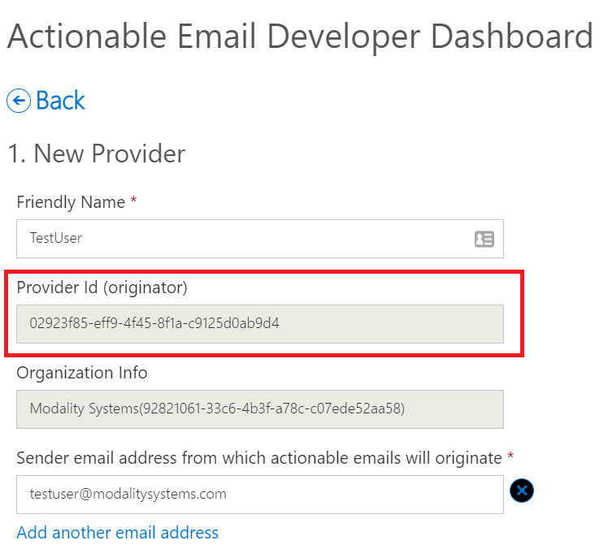
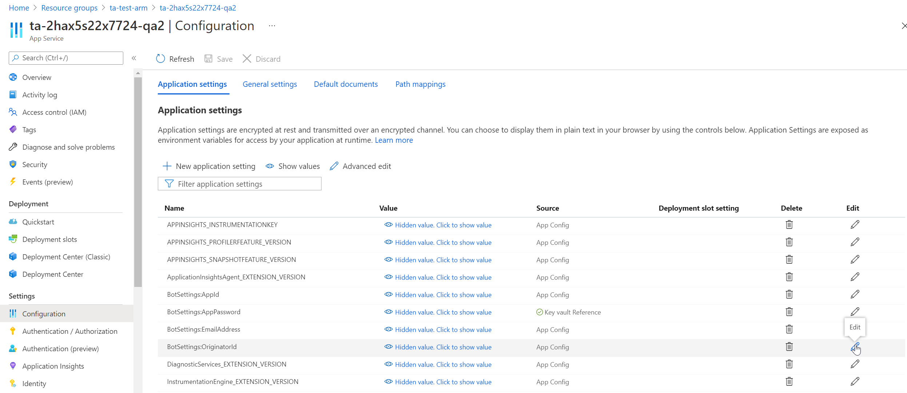

# Teamwork Analytics Automation - Overview & Requirements

## Overview

Teamwork Analytics Automation (TWA Automation) enables you to send automated private messages direct to Microsoft Teams users, encouraging usage, ensuring compliance, data security and best practices.

TWA Automation is deployed in two parts: a locally run Bot Notification Service, and a Modality-managed cloud solution that brokers and delivers messages to users.

## Pre-requisites

* You must already be running Teamwork Analytics.
* The local Bot Notification Service can be run on the same instance as the TWA Collector Service. It is configured with its own schedule, set up in Task Scheduler.
* The machine running the Bot Notification Service will need HTTPS 443 outbound access in order to message the Modality-managed broker service.
* Modality Systems will provide the manifest file for a Microsoft Teams application, to be side-loaded by an tenant administrator. Read more about [Publishing a custom app by uploading an app package](https://docs.microsoft.com/en-us/MicrosoftTeams/upload-custom-apps).
* If wanting to use "Proactive Bot" functionality
  * Admin consent for graph permissions will be required.
  * Application **must** be published to tenant store.
* If wanting to use "Unified Template" functionality **and** want to use email (requirement does not apply to IM)
  * Email originator requires configuring via the [Microsoft's developer dashboard](https://docs.microsoft.com/en-us/outlook/actionable-messages/email-dev-dashboard)
    * Update the bot web app "BotSettings:OriginatorId" setting, with the value found on the developer dashboard.

## Admin Consent for Bot

For the bot to be able to self-install for a user, it is a requirement that a Office 365 Global Admin of that tenant grants admin consent. 

1. This can be done by [generating a URL](https://docs.microsoft.com/en-us/azure/active-directory/manage-apps/grant-admin-consent#construct-the-url-for-granting-tenant-wide-admin-consent). You will require the customers tenant ID and the application registration ID of the bot. Contact someone in Modality Support Team to retrieve if needed.

2. These are the permissions **Microsoft Graph Permissions (Application)** that will be required:
   - **TeamsAppInstallation.ReadWriteSelfForUser.All** Read and write installation data - Allows the app to read, install, upgrade, and uninstall itself to any user, without a signed-in user. Does not give the ability to read application-specific settings.
     - If this permission is not granted, the default behavoir will be to send an email, with the user opting in to receiving a Microsoft Teams chat.

3. The Admin Consent that you just consented to, will be visible within the Enterprise Applications section of Azure AD
   

## Experience

Today, TWA Automation supports any scenario that can be thought of using the data TWA is capable of retrieving using Microsoft Graph. In order to configure a scenario, [read this guide](TWA-Automation-ConfigurableScenarios.md). There are no limits to the amount of scenarios you can configure.

By default, 4 automation scenarios are supplied by default: Team Ownership, Guest Report, Inactive Team, Deleted Team. Read more about [each scenario](TWA-Bot-Scenarios.md). These exist as they were part of the original iteration of TWA Automation and work in the same way as they did before, just adapted to work with the architecture implemented for configurable scenarios.

The frequency of notification is configurable. When a user is eligable for a message it is sent by either email or Microsoft Teams 1-to-1 chat message, depending on the user preference. By default, messages are sent by email unless the user opts-in to receiving them by Teams chat.

## Data sent to Modality-managed cloud solution

The following information is sent from the locally run Bot Notification Service to the Modality-managed cloud solution. All information is sent over HTTPS:

* Tenant ID
* User ID
* User UPN
* Type of message being delivered
* Information relavent to the scenario and shown in the message. This will be whatever you decide to output in the configured scenario. The default scenarios, would include team names, last activity date, number of guests and number of owners.

## Support for Buttons and Form input in Adaptive Cards

Modality provides adaptive cards with no buttons or inputs at this time. Modality do support HTTP post calls when a user presses a button. Customers can use this HTTP post call support to add their own buttons/forms to adaptive cards and link them to Microsoft Flow, Azure Logic apps or anything else that supports HTTP post.

Teamwork Analytics product support does not include support for creating Flow or Logic apps, but if customers purchase Customer Intelligence time our CI team can *assist* customers with the development of these adaptive cards and scenarios. Here is a documented example of using a Logic App in an Adaptive Card: https://github.com/modalitysystems/modalitysoftware-docs/blob/master/twa/automation/MakingALogicAppWebhook.md

In 2021 Q3 Modality intend to ship several default adaptive card templates that make use of Microsoft Azure Logic apps and store user input/feedback/button presses/form input in the Teamwork Analytics database for further automation and reporting.

### Adaptive Card button submission

At this time, we do not support dynamically changing a button in adaptive cards from "submit" to "submitted" or "Thankyou" once pressed. Once pressed the button will still say "submit". This is also coming in 2021 Q3. There is a code change needed to support this.

Microsoft are also adding a native "Success" banner to adaptive cards (this does not disable or change the submit button, which requires no code change. The GA date for this is not clear.

## Unified Templating - Email Configuration - DEPRECATED FEATURE

If the unified template feature is enabled, then this means that the bot will use the adaptive card templating for Teams IMs and emails. In order to email adaptive cards using the bot framework, configuration is required. Follow [Microsoft's documenatation](https://docs.microsoft.com/en-us/outlook/actionable-messages/email-dev-dashboard) to configure email services for the bot.
> The "sender email address" that is required in the form, must match the value specified in the bot web app under BotSettings:EmailAddress.

> Most customers will only require "Organisation" self-service registration, which a tenant admin can approve. **However, those that require "Global" will need to wait up to 2 weeks for Microsoft to provision their request. Check documenation for more information**.

Once a provider has been created using [Microsoft's documenatation](https://docs.microsoft.com/en-us/outlook/actionable-messages/email-dev-dashboard), grab the originator value from the form:

* Go to the Azure Portal home page and follow the following steps:
  * Click "resource groups"
  * Find and open the resource group for TWA Automation
  * Open the app service
  * Go to configuration
  * Click the edit button for the BotSettings:OriginatorId value
  * Insert the originator id value that was copied from the account via the developer dashboard
  * Click save after updating the value

> This configuration only applies to if email is required when using unified templating. If ExampleAutomationGuestScenario the customer wants to enable is Teams IM, then the above configuration is not required.

