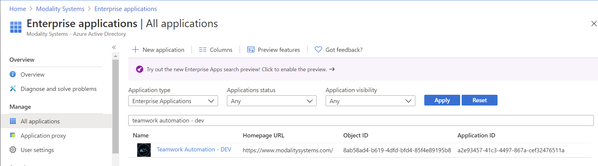

# Teamwork Analytics Automation - Overview & Requirements

## Overview

Teamwork Analytics Automation (TWA Automation) enables you to send automated messages direct to users via email or Microsoft Teams, enforcing compliance and data security.

TWA Automation is deployed in two parts: a locally run Bot Notification Service, and a Modality-managed cloud solution that brokers and delivers messages to users.

## Pre-requisites

* You must already be running Teamwork Analytics.
* The local Bot Notification Service can be run on the same instance as the TWA Collector Service. It is configured with its own schedule, set up in Task Scheduler.
* The machine running the Bot Notification Service will need HTTPS 443 outbound access in order to message the Modality-managed broker service.
* Modality Systems will provide the manifest file for a Microsoft Teams application, to be side-loaded by an tenant administrator. Read more about [Publishing a custom app by uploading an app package](https://docs.microsoft.com/en-us/MicrosoftTeams/upload-custom-apps).
* IF wanting to use "Proactive Bot" functionality
  * Admin consent for graph permissions will be required.
  * Application **must** be published to tenant store.

## Admin Consent for Bot

For the bot to be able to self-install for a user, it is a requirement that a Office 365 Global Admin of that tenant grants admin consent. 

1. This can be done by [generating a URL](https://docs.microsoft.com/en-us/azure/active-directory/manage-apps/grant-admin-consent#construct-the-url-for-granting-tenant-wide-admin-consent). You will require the customers tenant ID and the application registration ID of the bot. Contact someone in Modality Support Team to retrieve if needed.

2. These are the permissions **Microsoft Graph Permissions (Application)** that will be required:
   - **TeamsAppInstallation.ReadWriteSelfForUser.All** Read and write installation data - Allows the app to read, install, upgrade, and uninstall itself to any user, without a signed-in user. Does not give the ability to read application-specific settings.
     - If this permission is not granted, the default behavoir will be to send an email, with the user opting in to receiving a Microsoft Teams chat.

3. The Admin Consent that you just consented to, will be visible within the Enterprise Applications section of Azure AD
   

## Experience

Today, TWA Automation supports any scenario that can be thought of using the data TWA is capable of retrieving using Microsoft Graph. In order to configure a scenario, [read this guide](TWA-Automation-ConfigurableScenarios.md). There are no limits to the amount of scenarios you can configure.

By default, 4 automation scenarios are supplied by default: Team Ownership, Guest Report, Inactive Team, Deleted Team. Read more about [each scenario](TWA-Bot-Scenarios.md). These exist as they were part of the original iteration of TWA Automation and work in the same way as they did before, just adapted to work with the architecture implemented for configurable scenarios.

The frequency of notification is configurable. When a user is eligable for a message it is sent by either email or Microsoft Teams 1-to-1 chat message, depending on the user preference. By default, messages are sent by email unless the user opts-in to receiving them by Teams chat.

## Data sent to Modality-managed cloud solution

The following information is sent from the locally run Bot Notification Service to the Modality-managed cloud solution. All information is sent over HTTPS:

* Tenant ID
* User ID
* User UPN
* Type of message being delivered
* Information relavent to the scenario and shown in the message. This will be whatever you decide to output in the configured scenario. The default scenarios, would include team names, last activity date, number of guests and number of owners.

