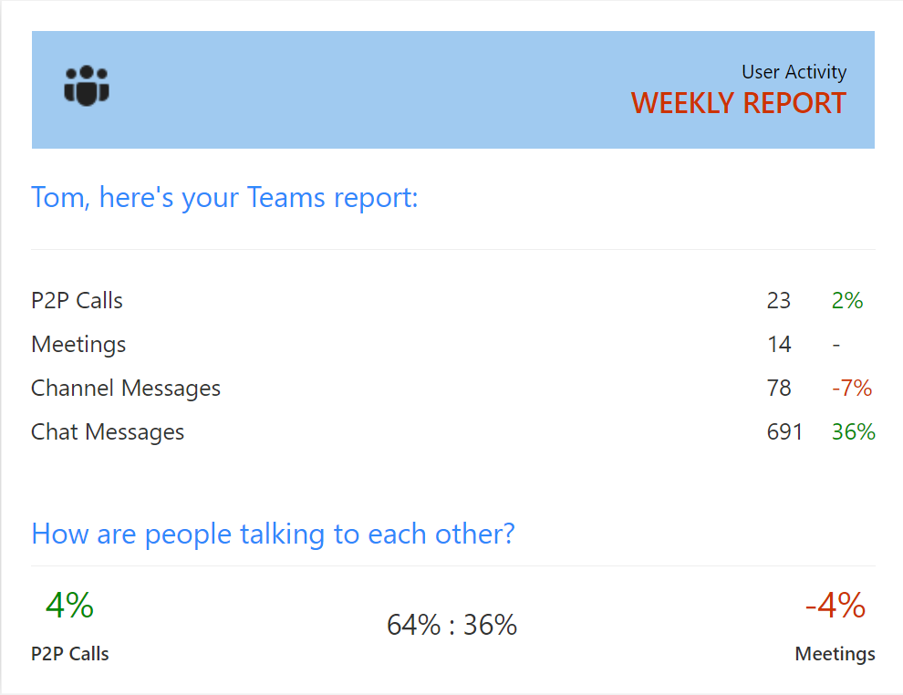

# Teamwork Analytics Automation - Scenarios

All of the following scenarios are deployed with TWA, if you have selected to include the notification service.

For each scenario you will find a description of the scenario and any default configured values (highlighted in **bold**). For each scenario we are able to configure the _email message subject_ and _message content_.

TWA Automation can Teams chat messages or emails. If the target user has installed the TWA Automation bot, they will receive a Teams message, if they don't have the bot installed they will receive an email. There is the option for TWA automation to self-install onto a users Teams client, this requires additional configuration. All emails are be sent from tips@teamworktips.email, please whitelist this address if required.

> Previously TWA Automation required different templates for Teams messages and emails, the messages that were sent also looked different, the old documentation for this can be found [here](./../BotsContent.md).

Please email Software.Support@modalitysystems.com if you require any customisation to the default scenarios or wish to discuss additional scenarios.

> Each notification can contain a maximum of 35 teams, if there are more than 35 teams, only the first 35 will be included in the notification. This is due to a restriction of bot framework message sizes.

> A single adaptive card template is used to generate the message sent to Teams and via email. This means they look very similar when viewed in both. The screenshots below where all taken in Outlook.

For easy navigation, the scenarios have been grouped:

- [**Default**](#default-scenarios)
- [**User Activity Statistics**](#user-activity-statistics-scenarios)

## Default Scenarios

### Team Ownership

The owner will receive this message if they are the owner of a team which has less than **2 owners**. It is advised that the existing owner should the take action to nominate/request an additional team owner.

Email subject - Teams with Owner Counts Notification

### Guest Members

The owner will receive this message if they are the owner of a team which includes external guests. Team owners can then review Team content and guest membership to ensure it's still valid for use as initially intended.

Email subject - Teams with Guests Notification

### Inactive Team

The owner(s) will receive this message if they are the owner of a team which has had no activity within the last **30 days**.

Email subject - Teams Last Activity Notification

### Deleted Team

The owner(s) will receive this message if they are the owner of a team which has been recently deleted. They will only receive one notification about each deleted team.

Email subject - Deleted Team Notification

## User Activity Statistics Scenarios

### Weekly User Statistics

Each user receives this message which summarises the number of calls, meetings and messages sent in the last 28 days. It also compares the values with those of the previous period.

Email subject - Teams Weekly User Statistics

### Monthly User Statistics

Content - TODO **\*\***\*\***\*\***
Screenshot - TODO **\*\***\*\***\*\***
Email subject - TODO **\*\***\*\***\*\***
