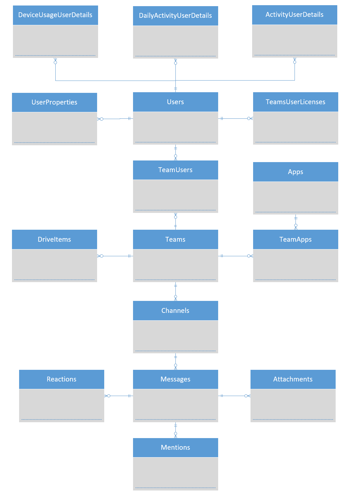

# Tables

---

## Objects

| Name | Description |
|---|---|
| [dbo.ActivityCounts](ActivityCounts.md) | _Get the number of Microsoft Teams activities by activity type. The activity types are number of teams chat messages, private chat messages, calls, or meetings._ |
| [dbo.ActivityUserCounts](ActivityUserCounts.md) | _Get the number of users by activity type. The activity types are number of teams chat messages, private chat messages, calls, or meetings._ |
| [dbo.ActivityUserDetails](ActivityUserDetails.md) | _Get details about Microsoft Teams user activity by user._ |
| [dbo.Apps](Apps.md) | _Apps installed across all Teams in the organisation._ |
| [dbo.Attachments](Attachments.md) | _Attached files/content to Messages._ |
| [dbo.Channels](Channels.md) | _Teams Channels in the organisation._ |
| [dbo.DailyActivityUserDetails](DailyActivityUserDetails.md) | _Get details about Microsoft Teams user activity by user per day._ |
| [dbo.DeviceUsageDistributionUserCounts](DeviceUsageDistributionUserCounts.md) | _Get the number of unique users by device type over the selected time period._ |
| [dbo.DeviceUsageUserCounts](DeviceUsageUserCounts.md) | _Get the number of daily unique users by device type._ |
| [dbo.DeviceUsageUserDetails](DeviceUsageUserDetails.md) | _Get details about Microsoft Teams device usage by user._ |
| [dbo.DriveItemPermissions](DriveItemPermissions.md) | _Permissions granted on files._ |
| [dbo.DriveItems](DriveItems.md) | _Files in Teams._ |
| [dbo.Mentions](Mentions.md) | _Mentioned entities within Messages._ |
| [dbo.Messages](Messages.md) | _Messages within Teams Channels._ |
| [dbo.Reactions](Reactions.md) | _Reactions provided by users to Messages._ |
| [dbo.TeamApps](TeamApps.md) | _Link table between dbo.Teams and dbo.Apps. Can be used to identify teams installed in an app._ |
| [dbo.Teams](Teams.md) | _Teams within the organisation._ |
| [dbo.TeamsUserLicences](TeamsUserLicences.md) | _History of Teams License assignment per user (from when TWA was installed). Use the max AssignedDateTime for the current license status._ |
| [dbo.TeamUsers](TeamUsers.md) | _Link table between dbo.Users and dbo.Teams. Can be used to identify which users are in each team._ |
| [dbo.UserProperties](UserProperties.md) | _Custom User attributes. Will be empty if custom attributes are not configured._ |
| [dbo.Users](Users.md) | _Users within the organisations Asure Active Directory._ |

---

# Entity Relationship Diagram

---

---

###### Author:  Rob Taylor

###### Copyright 2020 - All Rights Reserved

###### Created: 26 June 2020 11:20:43

