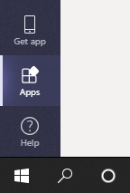
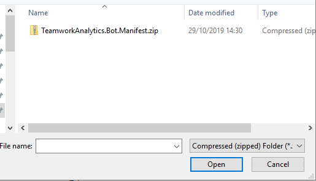
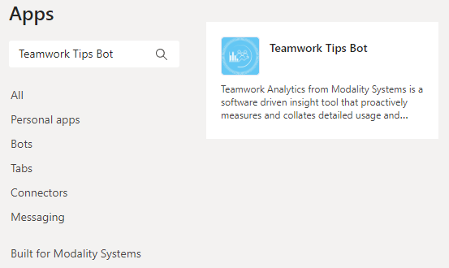
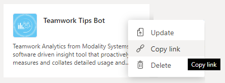
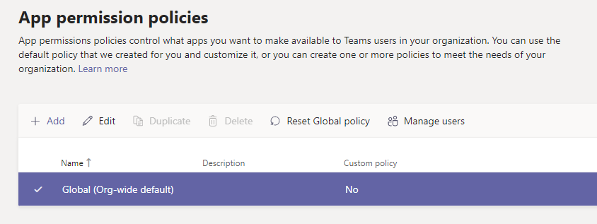

# How to deploy the Teamwork Analytics Bot App into Teams

The Teamwork Analytics Bot is provided as an Microsoft Teams App which needs to be uploaded to your organisation's Apps section within Microsoft Teams.

### Before you start

[Download the latest Teamwork Analytics Bot manifest file](https://github.com/modalitysystems/TeamworkAnalyticsGABuilds/releases/latest).

> NOTE: Some of the steps below require making changes to your Microsoft Online Tenant which can sometimes take a few hours to take effect.

> NOTE: In order for bots to work, an optional component of the Data Collector Backend, named the Notification Service, must be enabled and a unique key must be shared with Modality. This may require the Data Collector Backend to be redeployed. See *[Teamwork Analytics Data Collector Deployment](deploytwa.md)* for instructions.

## Installation

1. 1.	From Microsoft Teams go to the Apps section
   
   
   
2. Then select Upload for [YOUR ORGANISATION NAME]
   
   
   
3. Then select the downloaded App manifest file zip file
   
   

4. The App should then appear within your companies Apps section
   
   
   
5. Once this has been completed, click the "..." button in the top right corner of the app and click Copy link. Provide this link to Modality alongside your Tenant ID as these required for provisioning on the Modality hosted bot platform.
   
   
   
## Allow App to be installed within Microsoft Teams

Now that the App has been added to your Microsoft Teams Tenant, your Global policy may need to be adjusted to allow it to be installed by users.

1. From the Microsoft Teams Admin Center, under *Teams apps* click *Permission policies*

   
    
2. Click on *Global (Org-wide default)* (or whatever policy is applied to your organisation)

   

3. Make sure the *Tenant apps* policy is set to Allow all apps

   

> NOTE: You could also specify a list of allowed apps here 
