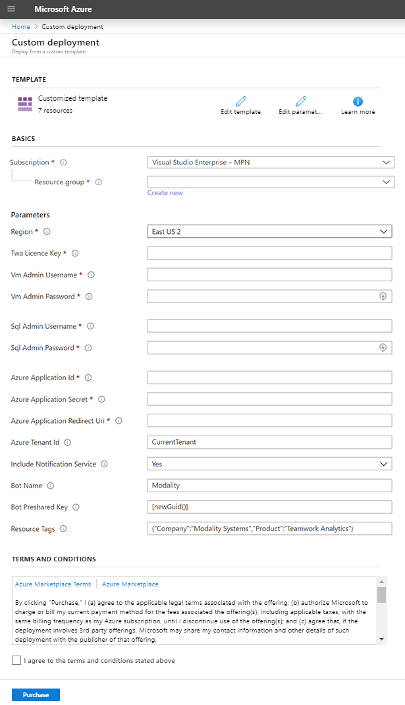
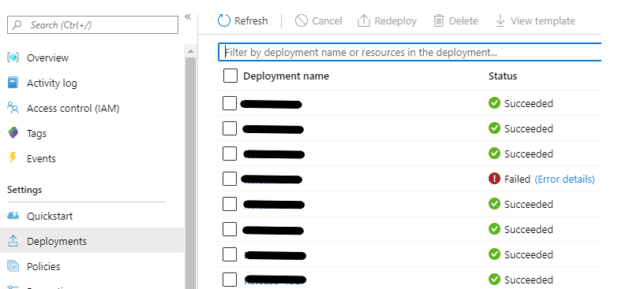
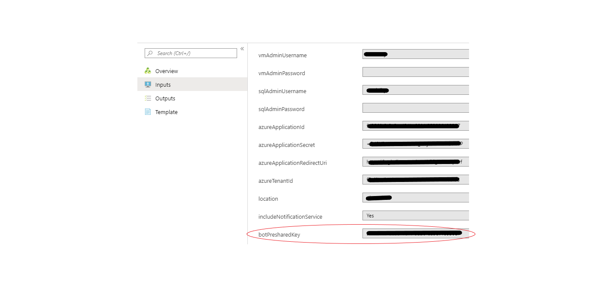

# How to deploy Teamwork Analytics

Teamwork Analytics is provided as an Azure Resource Manager (ARM) template that automatically provisions and starts the required resources in your Azure subscription.

> Note: You will need a trial or full licence key, contact Software.Support@modalitysystems.com for a key if you do not have one.

> Note: You must have [registered an application](registerapplication.md) beforehand.

> Note: For an introduction to Azure Resource Manager see [docs.microsoft.com](https://docs.microsoft.com/en-us/azure/azure-resource-manager/resource-group-overview).

This ARM Template will install resources in your Azure tenant. The template will deploy the following resources:

| Service Type  | Description   |
| ------------- | ------------- |
| Virtual Machines  | 1 B2MS (2 vCPU(s), 8 GB RAM) x 730 Hours; Windows – (OS only); Pay as you go; 1 managed OS disks – P10† |
| Azure SQL Database  | Single Database, DTU purchase model, Standard tier, S2: 50 DTUs, 250 GB included storage per DB, 1 Database(s) x 730 Hours, 5 GB retention  |
| Virtual Network  | 100 GB data transfer from region to region  |
| IP Addresses  | 1 Dynamic IP Addresses, 0 Static IP Addresses  |
| Storage Accounts  | Block Blob Storage, General Purpose V1, LRS Redundancy, 1,000 GB Capacity, 100 Storage transactions |

> † By default TWA is configured to save up to 10GB of diagnostic logs to text files in its installation directory. Please ensure that the virtual machine has enough disk space for this eventuality. For more information see [Collecting Logs](CollectingLogs.md).
> Note: Windows updates, by default, are automatically managed by Azure, see [here](https://docs.microsoft.com/en-us/azure/automation/automation-update-management#windows) for details. We do not change any Windows Update settings, so if you require something different you will need to configure this manually post deployment.

Pricing to run these Azure components in your tenant vary and are subject to change. [View the current price estimate](https://azure.com/e/3c58dcaaa4ee498d92ed80cbec706ea9).

## Installation

1. Click on the 'Deploy to Azure' button above. You will be taken to Microsoft Azure Portal and a deployment form will open as shown below.

   

2. Carefully fill in the fields. In some cases the tooltips may provide extra guidance. 
   - Basics
     - **Subscription** - Choose the Azure subscription to which deployed resources will be billed.
     - **Resource group** - It is strongly recommended that you create a new resource group for logical grouping and management of Teamwork Analytics. *When applying an upgrade choose the Resource Group that already contains Teamwork Analytics.*
     - **Location** - The location of the newly created resource group (this only determines the geographical location of resource group and its metadata, to change the location of the resources themselves, see *Location* below).
   - Settings
     - **Vm Admin Credentials** - your choice of username and password that an administrator can use to sign in to the VM running Teamwork Analytics.
       > Note: RDP is disabled by default for enhanced security.
     - **Sql Server Credentials** - your choice of username and password that an administrator can use to sign in to the SQL database hosting Teamwork Analytics data. 
     - **Azure Application details** - Use the details you generated when [registering an application](registerapplication.md).
     - **Azure Tenant ID** - A globally unique identifier (GUID) that identifies the organization for which Teamwork Analytics will gather Teams usage data. By default this field uses `[subscription().tenantId]`, which gets automatically replaced with Tenant ID of the chosen subscription.
       > Note: If you used a different Tenant ID when [registering an application](registerapplication.md), you must delete the contents of this field and enter the correct Tenant ID.
     - **Location** - The geographical location of the Azure resources that will host Teamwork Analytics. By default this field uses `[resourceGroup().location]`, which gets automatically replaced with location of the chosen Resource Group. Optionally you can delete this and enter the name of a different location.
       > Note: Do not include the region prefix in brackets, e.g. use "Central US" rather than "(US) Central US".
     - **Include Notification Service** - Yes / No field. The Notification Service is an additional feature required to send pro-active messages to users via Bot/Email to improve adoption. Set to Yes if you plan to use the Teamwork Analytics bot. 
        > Note: For more information about the Teamwork Analytics bot, see [How to deploy the Teamwork Analytics Bot App into Teams](deployteamsapp.md).
      - **Bot Preshared Key** - A password used to secure the bot service. By default this field uses `[newGuid()]`, which gets replaced with a randomly generated globally unique password.
        > Note: This is a mandatory field, if you don't want to include the Bot, leave the default and it will have no effect.

        > Note: This must be in the Global Unique Identifier (GUID) format. See [here](http://guid.one/guid) for more information.
      - **Include Yammer Data** - Yes / No field. Yammer Data Collection is an additional feature that can be enabled. Set to Yes if you plan to include Yammer Data in your reports. This feature also requires a Yammer API Token to have been configured in advance and also a valid TWA Licence Key. 
      - **Yammer Data Token** - A Yammer Applicication Bearer Token is required for the Teamwork Analytics Service to gather Yammer Data.
        > Note: This is a mandatory field, if you don't want to include the Yammer Data, leave the default and it will have no effect.

        > Note: To create a Yammer Application Bearer Token, see [here](yammerAPIToken.md) for more information.
        
      - **License Key** -  You will need a trial or full licence key, contact info@modalitysystems.com for a key if you do noy have one.

3. Read the Terms and Conditions, then click "I agree to the terms and conditions stated above" and click "Purchase" (this refers to the resources hosted on Azure, and is not a usage agreement for Teamwork Analytics.)

4. Once the deployment is complete, if you have opted to include the Notification Service, you will need to provide the Bot Preshared Key to Modality to allow us to authenticate with your deployment. If you left the default of `[newGuid()]`, you need to retrieve the value from Deployment history;
  
      a. In the Resource Group which you chose to deploy to, click Deployments on the left hand menu under settings, and then click the latest deployment (at the top) as below
      

      b. Once open, click inputs and retrieve the value for xx and pass it on to the Modality team as shown below.
      

## Pausing or uninstalling

Teamwork Analytics can be managed via its Resource Group in [Azure Portal](https://portal.azure.com/).

* To pause the data gathering process, use Azure Portal to navigate to the virtual machine (usually named *twa-vm*) inside the Resource Group, and click "Stop". To resume the process, click "Start". Teamwork Analytics runs as a Windows service that starts automatically with the Virtual Machine.
* To uninstall Teamwork Analytics completely, **including deleting Teams usage data**, simply delete the Resource Group. This will delete all the resources therein. You will be prompted to type in the name of the Resource Group for confirmation.
  > **Note: This will delete all the Teams usage data gathered by Teamwork Analytics!**
