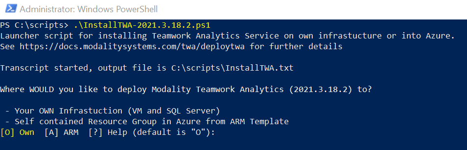
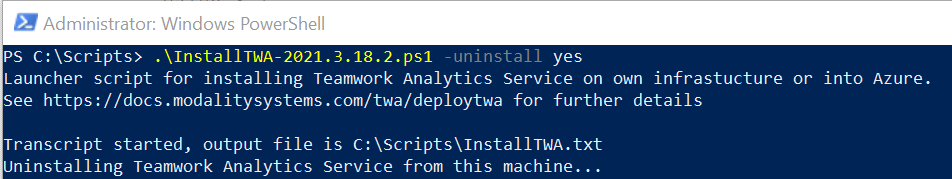

# How to deploy Teamwork Analytics

Teamwork Analytics is provided as an **Azure Resource Manager (ARM) template** that automatically provisions and starts the required resources in your Azure subscription but can also be installed on a **Customer Provided Windows VM** that writes to a customer provided SQL Server 2016 or higher database. Both modes of deployment are achieved by using the same deployment script

> Note: You will need a trial or full licence key, contact Software.Support@modalitysystems.com for a key if you do not have one.

> Note: You must have [registered an application](registerapplication.md) beforehand.

> Note: For an introduction to Azure Resource Manager see [docs.microsoft.com](https://docs.microsoft.com/en-us/azure/azure-resource-manager/resource-group-overview).

Download [InstallTWA.ps1](https://github.com/modalitysystems/TeamworkAnalyticsGABuilds/releases), the PowerShell script is version stamped and will install the version of Teamwork Analytics that matches the download.

Each script is signed and will require an **Administrative PowerShell** window and the following PowerShell module to be installed before attempting to run the scripts:

- [Azure PowerShell](https://docs.microsoft.com/en-us/powershell/azure/install-az-ps-msi)
  
They will also need to be able to access the internet so if you are running the scripts from behind a web proxy then this will need to be configured. First off run the PowerShell script by typing the name of the script from the script directory

  

Enter **O** to download and install Teamwork Analytics on the Windows machine that the script is being run from, or **A** to install all required components into Azure using an ARM Template

The script can also be used to move Teamwork Analytics from the machine that the script is being run from into Azure

Once you have made your selection enter the information as prompted, all selections are saved to a parametersFile.json file that will be read the next time the script is run to make upgrades easier

For ARM Template deployments the following will be installed in your Azure tenant:

| Service Type  | Description   |
| ------------- | ------------- |
| Virtual Machines  | 1 B2MS (2 vCPU(s), 8 GB RAM) x 730 Hours; Windows – (OS only); Pay as you go; 1 managed OS disks – P10† |
| Azure SQL Database  | Single Database, DTU purchase model, Standard tier, S2: 50 DTUs, 250 GB included storage per DB, 1 Database(s) x 730 Hours, 5 GB retention  |
| Virtual Network  | 100 GB data transfer from region to region  |
| IP Addresses  | 1 Dynamic IP Addresses, 0 Static IP Addresses  |
| Storage Accounts  | Block Blob Storage, General Purpose V1, LRS Redundancy, 1,000 GB Capacity, 100 Storage transactions |

> † By default TWA is configured to save up to 10GB of diagnostic logs to text files in its installation directory. Please ensure that the virtual machine has enough disk space for this eventuality. For more information see [Collecting Logs](CollectingLogs.md).

> Note: Windows updates, by default, are automatically managed by Azure, see [here](https://docs.microsoft.com/en-us/azure/automation/automation-update-management#windows) for details. We do not change any Windows Update settings, so if you require something different you will need to configure this manually post deployment.

Pricing to run these Azure components in your tenant vary and are subject to change. [View the current price estimate](https://azure.com/e/3c58dcaaa4ee498d92ed80cbec706ea9).

Once the deployment is complete, if you have opted to include the Notification Service, you will need to provide the Bot Preshared Key to Modality to allow us to authenticate with your deployment. This can be found in the parametersFile.json

## Upgrading

Each time the script is run and regardless of deployment mode that has been chosen, the Teamwork Analytics services are removed and then a new service is installed. If you are using a different version script than was used before then that version will be installed. When the service starts the database will attempt to be upgraded. If a parametersFile exists in the script folder then this will be read and used for the deployment. However, if there is no parametersFile then you will need to complete all information as prompted

## Updating Power BI apps

The process for updating an app is exactly the same as the initial installation. You install the latest version side by side and configure it then delete the existing version.

When installing the latest version from AppSource select "Install to a new workspace" and click _Install_.

When the new version is installed, the old version can be unpublished by deleting its workspace.

> The "Overwrite an existing version (Preview)" option is not recommended until it becomes fully supported. 

Detailed steps here: [PowerBI Install Guide](/twa/PowerBIAppsAdminInstallGuide.html)

## Pausing or uninstalling

1. If you selected **O** to download and install Teamwork Analytics on the Windows machine that the script is being run from then you can start and stop the **ModalityTeamworkAnalytics** windows service and where the Notification service has been deployed then you can disable the Scheduled Tasks that start with **Bot** to prevent messages being sent to the Automation Bot

* To uninstall the service from the machine that the script is being run, use the -uninstall yes switch

  

1. If you selected **A** to install all required components into Azure using an ARM Template then Teamwork Analytics can be managed via its Resource Group in [Azure Portal](https://portal.azure.com/).

* To pause the data gathering process, use Azure Portal to navigate to the virtual machine (usually named *twa-vm*) inside the Resource Group, and click "Stop". To resume the process, click "Start". Teamwork Analytics runs as a Windows service that starts automatically with the Virtual Machine.
* To uninstall Teamwork Analytics completely, **including deleting Teams usage data**, simply delete the Resource Group. This will delete all the resources therein. You will be prompted to type in the name of the Resource Group for confirmation.
  > **Note: This will delete all the Teams usage data gathered by Teamwork Analytics!**