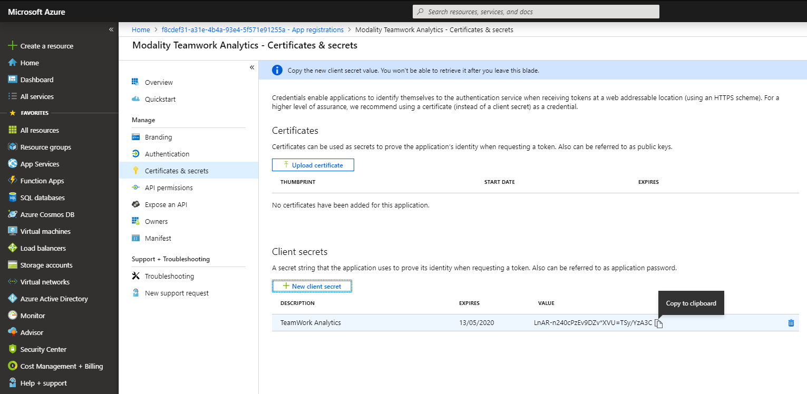
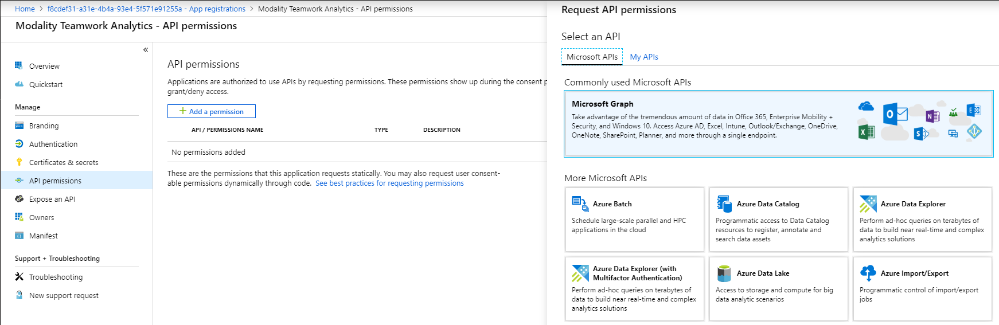
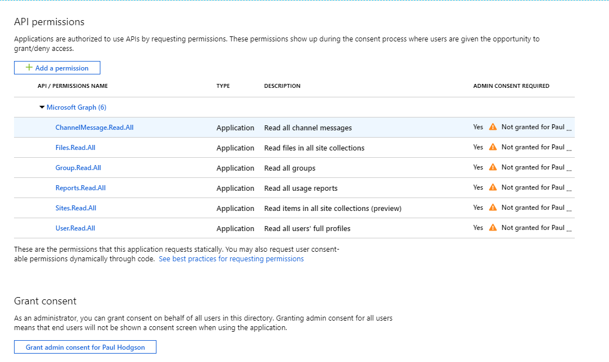
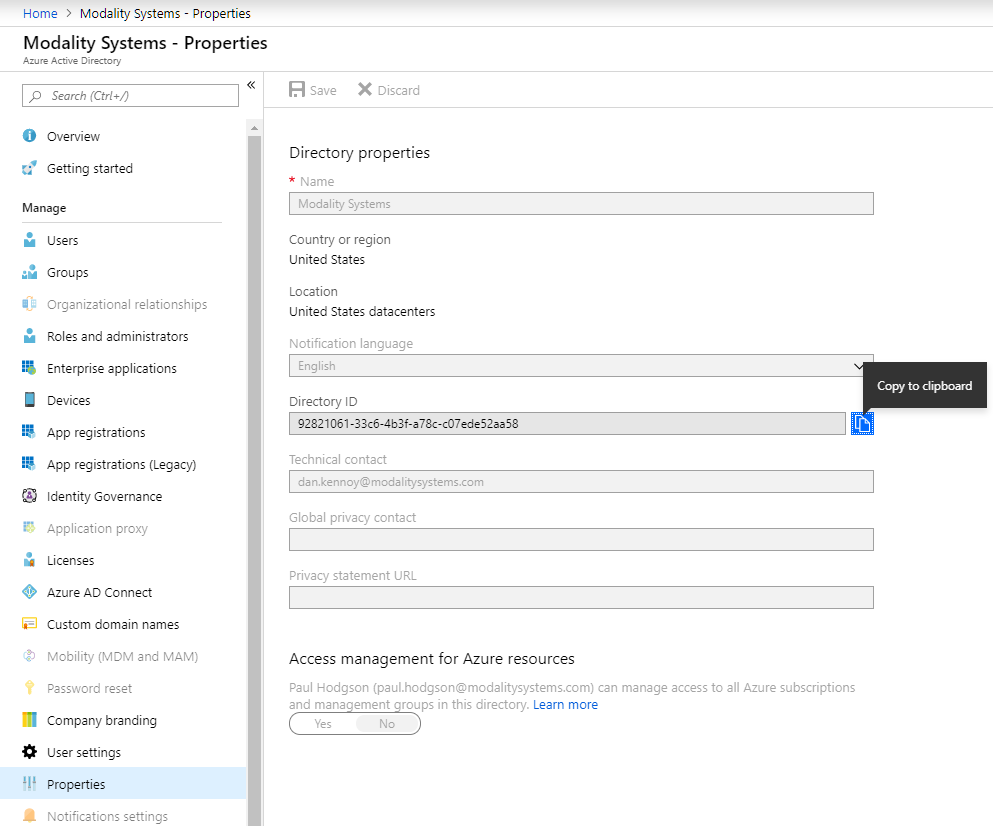

## Registering Teamwork Analytics as an Azure Application
This document describes the process of registering Teamwork Analytics Client as an Azure Application as the first step to deployment.  As part of the registration you will gather the following information for use further along the deployment process.
   * Application ID
   * Application Secret
   * Tenant ID

### Register Teamwork Analytics with Azure Active Directory
1. Sign in to the [Azure Portal](https://azure.portal.com)
1. Select the **Azure Active Directory** service from the navigation pane on the left 
1. Select **App Registrations** and click **New Registration** (Take care not to select **App Registrations (Legacy)** as these instructions do not apply to them)
1. Enter the following application registration details
   * **Name** - must be **Modality Teamwork Analytics** (this name is important for the application to work correctly)
   * **Supported Account Types** - Recommend setting this to **Accounts in this Organisational Directory Only**
   * **Redirect URI** - The authorization endpoint used by Teamwork Analytics - Recommend setting this to **https://login.live.com/oauth20_desktop.srf** 
   * (The **Redirect URI Type** dropdown can be left as the default value of **Web**)
1. Click **Register** and Azure AD will create an Application ID and present the Overview page

1. Take note of the **ApplicationID** as this will be required futher in the deployment process

### Add a Client Secret
1. Navigate to the **Azure Active Directory** from the navigation pane on the left
1. Select **App Registrations** and select the **Modality Teamwork Analytics** app 
1. Select **Certificates & secrets** from the Manage menu
1. Select **New client secret** and enter an appropriate description and expiry period
   * **Description** - Recommend setting this to **TWA-Secret**
   * **Expiry** - Recommend setting this to **Never**
1. Click **Add**
1. Immediately take note of the **Secret** as this can not be retrieved later and will be required further in the deployment process

### Declare API Permissions for Teamwork Analytics
1. Navigate to the **Azure Active Directory** from the navigation pane on the left
1. Select **App Registrations** and select the **Modality Teamwork Analytics** app 
1. Select **Api permissions** from the Manage menu
1. Find and select **Microsoft Graph** from the **Request API permissions** blade

1. Ensure that the permission type is set to "Application permissions" and not "Delegated permissions"

1. Select the follow 6 permissions from Microsoft.Graph
   * ChannelMessages.Read.All
   * Directory.Read.All
   * Files.Read.All
   * Group.Read.All
   * Reports.Read.All
   * Sites.FullControl.All (Instead you can choose Sites.Read.All but file permission data will not be accurate in reporting)
   * User.Read.All
1. Click **Add permissions** to be returned to the "API permissions" blade
1. Click the **Grant Admin Consent for Your Name** button

### Retrieve your Tenant ID
1. Navigate to the **Azure Active Directory** from the navigation pane on the left
1. Select **Properties** 
1. Your Tenant ID is listed as **Directory ID**, copy this for later use

