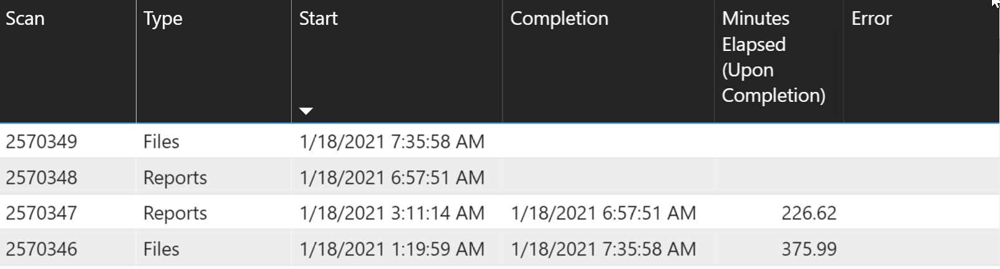
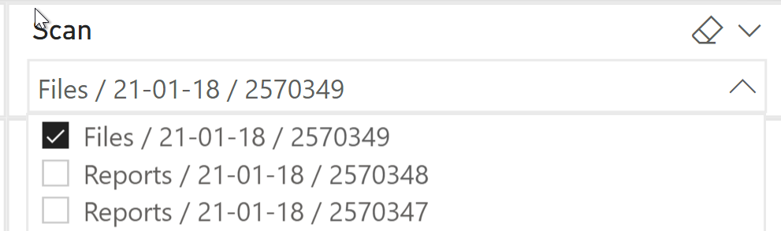
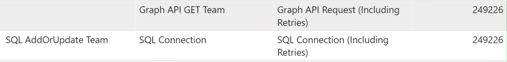

# Determining current state of the system

## Troubleshooting report

In the troublehsooting report, identify the scan you are interested in from the Scan History Page

This will list all the scans, both in progress and completed.

Once a scan id has been identified for further investigation, head over to the Health Page and select the scan from the drop down, ensuring no other filters are selected.

This will display a list of tasks and how many have completed. 

There are two main row types of interest.

- Graph API GET [Entity Type] @ Task L2
- SQL AddOrUpdate [Entity Type] @ Task L3

using the completed count for these two rows for a particular entity you can calculate

- How many records have been returned from graph
- How many records have been saved to the database

We also need to find out how many entities we're expecting to receive. for this we can do any of the following

- Look how many records for the entity there were on the last complete scan.
- Look in the database and on the table for the entity do a SELECT COUNT(*) WHERE Deleted = 0
- Use a microsoft portal/report

Once we have graph returned/saved/expected counts we can use them to compare and predict.

For example.
1. Graph API Get Team = 100
2. SQL AddOrUpdate Team = 50
3. Expected Team Count = 150.

- % from graph = 100/150 = 66%
- % saved to db = 50/150 = 33%

you can then use the duration of the scan so far to determine time of completion.

Example continued.
1. Current scan duration 1hr
2. % saved to db (from above) = 33%
- Estimated scan time = 1hr / 0.33 (33%) = 3hrs
- Estimated time remaining = 3hrs - 1hr = 2hrs

