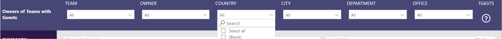

# User Reporting Filters
The filters for reports containing user data can be configured.

## Available filters
- GivenName
- Surname
- JobTitle
- OfficeLocation
- PreferredLanguage
- UsageLocation
- City
- Country
- Department
- UserPrincipalName
- Mail
- CustomUserAttribute1
- CustomUserAttribute2
- CustomUserAttribute3
- CustomUserAttribute4
- CustomUserAttribute5
- CustomUserAttribute6
- CustomUserAttribute7
- CustomUserAttribute8
- CustomUserAttribute9
- CustomUserAttribute10

The custom user attributes match up to those configured in [configuration].[CustomUserPropertiesForReporting]. see [here](twa/CustomUserAttributes.md) for more details

## Configuring

1. Edit [configuration].[UserReportingFilters]
2. Set the following columns to be a property from the available filters.
- [UserReportingFilter1]
- [UserReportingFilter2]
- [UserReportingFilter3]
- [UserReportingFilter4]
3. Set the following columns to be a user friendly display name describing the respective filter.
- [UserReportingFilter1DisplayName]
- [UserReportingFilter2DisplayName]
- [UserReportingFilter3DisplayName]
- [UserReportingFilter4DisplayName]
4. Refresh the report and see the new user filters in the filter bar on page.

## Defaults
The default values are
- [UserReportingFilter1] = Country
- [UserReportingFilter2] = City
- [UserReportingFilter3] = Department
- [UserReportingFilter4] = OfficeLocation
- [UserReportingFilter1DisplayName] = Country
- [UserReportingFilter2DisplayName] = City
- [UserReportingFilter3DisplayName] = Department
- [UserReportingFilter4DisplayName] = Office
