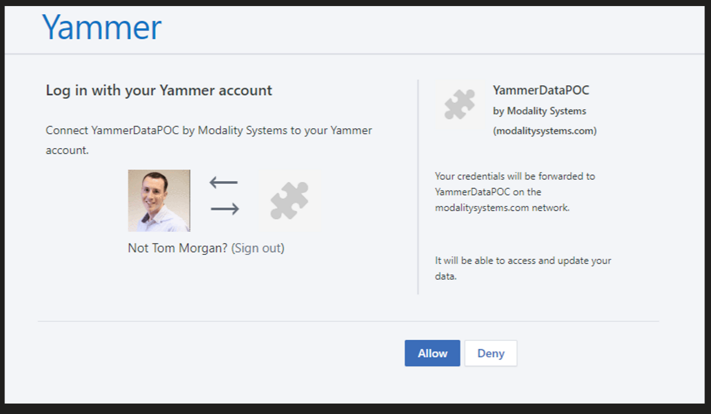

- register an app here: https://developer.yammer.com/docs/app-registration
- Get a Client ID and Secret. Set a redirect to something like your company homepage
- Go to https://www.yammer.com/oauth2/authorize?client_id={CLIENT_ID}&response_type=code&redirect_uri=https://modalitysoftware.com  (or whatever your redirect id is) see this, and click Allow 
- Collect the Code that's passed as a param to that page
- GET https://www.yammer.com/oauth2/access_token.json?client_id={CLIENT_ID}&client_secret={CLIENT_SECRET}&code={CODE}
- That gives you an auth token which is long-lived (seemingly for ever or until user revokes your app) which you then pass to every subsequent call as a Bearer token, so we need to store it somewhere. (this could be what an onboarding site could do, but totally optional extra, we can do this manually for now
