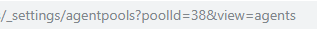

# VSTS-Agent

vsts-agent is a Docker image that includes many build tools for use with Azure DevOps pipelines. When a container is started it will download and register as an Azure agent based on given parameters. This is highly scalable and repeatable.

To get started [Install](https://docs.docker.com/install/windows/docker-ee/) Docker on Windows Server

Create a Docker [Swarm](https://docs.docker.com/engine/swarm/swarm-tutorial/create-swarm/) on 1, 3 or 5 Windows Servers

>From an administrative powershell run the following command:

docker service create --name ? --replicas ? -e AZP_URL=? -e AZP_TOKEN=? -e AZP_POOL=? -d modalitysystems/vsts-agent:ltsc2016-3.5

>To scale the service run the following command:

docker service scale ?=16

>To update the service run the following command:

docker service update ? --replicas ? --update-delay ? --update-parallelism ? --env-add AZP_URL=? --env-add AZP_TOKEN=? --env-add AZP_POOL=? --image modalitysystems/vsts-agent:ltsc2016-3.6

Update Parallelism allows you to define controlled batches to update so --replicas 16 --update-parallelism 8 would update 8, wait until they have all successfully updated and then update the remaining 8. Update Delay allows you define a wait period between Parallesium batches, Docker will see the container as being up before Azure sees the agent as being Online.

# CleanUp Offline Agents

When the Docker service starts a new container based agent, it will get the name of it's virtual MAC address which will come from the Hyper-V MAC pool. When the container is stopped, the old agent will remain in Azure DevOps in an Offline state. This [Rest API Script](scripts/ClearUpAgents.ps1) can be used to delete any Offline Agents.

To get the Pool ID, navigate to the required Agent Pool in Azure DevOps and look in the browser address bar

# Notes

>[Click here view image on Docker Hub](https://hub.docker.com/r/modalitysystems/vsts-agent)

>[Click here for list of installed tools](tools.md)

>[Click here for notes on how to customise the image](customise.md)

>[Click here for notes on basic troubleshooting tips](troubleshoot.md)
