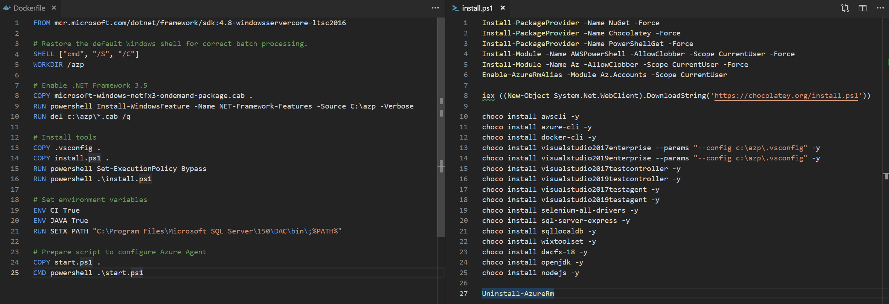

# Customise

To customise this image first [download](https://github.com/modalitysystems/modalitysoftware-docs/releases/download/ltsc2016/vsts-agent-ltsc2016.zip) the docker file package and extract

The tools installation has been taken out of the Dockerfile and put into a single install.ps1 file, this is to reduce the number of layers that Docker produces which greatly reduces of overall image size

Make appropriate adjustments but leave start.ps1 script unchanged

Open PowerShell from the extraction location and run the following command:

docker build -t vsts-agent:ltsc2016-1.0 -m 2GB .

To create a container from this image and access a powershell prompt run the following command:

docker run --rm -it vsts-agent:ltsc2016-1.0 powershell.exe

To create an Azure DevOps Agent from this image run the following command:

docker run -e AZP_URL=? -e AZP_TOKEN=? -e AZP_POOL=? -d vsts-agent:ltsc2016-1.0

# Push to Docker Hub

To avoid having to build an image on every Docker Host, the image should be pushed to [Docker Hub](https://docs.docker.com/docker-hub/repos/#pushing-a-docker-container-image-to-docker-hub)
