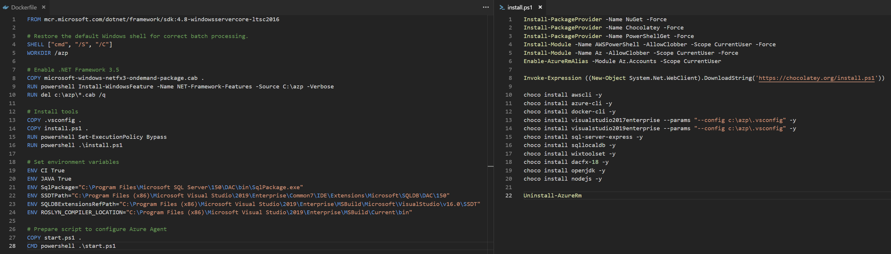
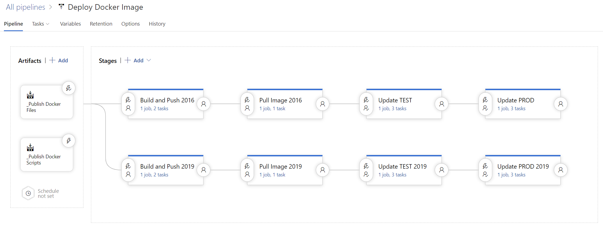

# Customise

To customise this image first download the [2016](https://github.com/modalitysystems/modalitysoftware-docs/releases/download/ltsc2016/vsts-agent-ltsc2016.zip) or [2019](https://github.com/modalitysystems/modalitysoftware-docs/releases/download/ltsc2019/vsts-agent-ltsc2019.zip) version of the docker file package, depending on your host os, and extract the downloaded zip file. Docker Enterprise in Server 2019 seems to have improved considerably from 2016

The tools installation has been taken out of the Dockerfile and put into a single install.ps1 file, this is to reduce the number of layers that Docker produces which greatly reduces of overall image size

Make appropriate adjustments but leave start.ps1 script unchanged

Open PowerShell from the extraction location and run the following command:

docker build -t vsts-agent:1.0 .

To create a container from this image and access a powershell prompt run the following command:

docker run --rm -it vsts-agent:1.0 powershell.exe

To create an Azure DevOps Agent from this image run the following command:

docker run -e AZP_URL=? -e AZP_TOKEN=? -e AZP_POOL=? -d vsts-agent:1.0

# Push to Docker Hub

To avoid having to build an image on every Docker Host, the image should be pushed to [Docker Hub](https://docs.docker.com/docker-hub/repos/#pushing-a-docker-container-image-to-docker-hub)

# Automate process with a Pipeline

Once you have your customised docker files, put them into source control and link them to a pipeline such as this:

