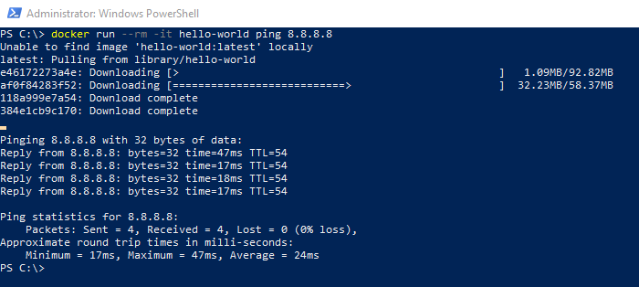

# Troubleshoot Tips

Both the Docker host and the Docker containers require access to the internet for this to work. To check this run:

docker run --rm -it hello-world ping 8.8.8.8

The first bit checks that the Docker host is able to download images from Docker Hub and the second bit checks that a container can ping a machine on the internet.
